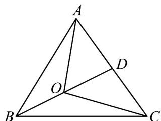

> [!faq]- 《专题02_平面向量的运算_高效培优期中专项训练_数学人教A版高一必修第》官方解析
>
> > [!success]- **【答案】** A
>
> > [!note]- **【解析】**
> > 因为 $\overrightarrow{OA} + 2\overrightarrow{OB} + \overrightarrow{OC} = 0$
> >
> > 所以 $OA + OC = -2OB = 2BO$ ,
> >
> > 所以 $BO=\frac{1}{2}\left(OA+OC\right)$
> >
> > 取 $AC$ 的中点 $D$ , 则, $\mathrm{OD} = \frac{1}{2} (\mathrm{OA} + \mathrm{OC})$ .
> >
> > $$
> > \therefore \stackrel {\rightarrow} {B O} = \stackrel {\rightarrow} {O D}
> > $$
> >
> > 则 $\triangle AOC$ 的面积为 $S_{1}$ ， $\triangle BOC$ 的面积为 $S_{2}$
> >
> > $$
> > S _ {\triangle A O C} = 2 S _ {\triangle C O D}, \because S _ {\triangle C O D} = S _ {\triangle B O C}, \therefore S _ {\triangle A O C} = 2 S _ {\triangle B O C}.
> > $$
> >
> > 所以 $\frac{S_{1}}{S_{2}}=2$ .
> >
> > 故选：A
> >
> > 
