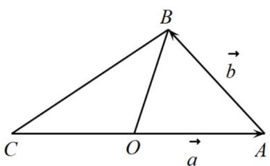
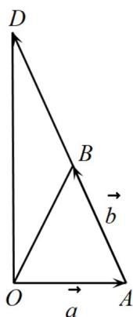

> [!faq]- 《专题02_平面向量的运算_高效培优期中专项训练_数学人教A版高一必修第》官方解析
>
> > [!success]- **【答案】** C
>
> > [!note]- **【解析】**
> > 
> >
> > 
> >
> > (2)
> >
> > 由非零向量 $a$ ， $b$ 满足 $\left|a + b\right| = \left|b\right|$
> >
> > 当 $a$ ， $b$ 不共线时，可考虑构造等腰三角形，如图（1）所示， $\overline{OA} = a,\overline{AB} = b$
> >
> > 则 $OB = a + b \cdot$ 在图（1）中， $\overline{CA} = 2a, \overline{CB} = 2a + b$
> >
> > 不能比较 $\left|2a\right|$ 与 $\left|2a+b\right|$ 的大小;
> >
> > 在图（2）中，由 $AB = BD = b, OB = a + b, |a + b| = |b|$ ，得 $OB = AB = BD$
> >
> > 所以 $\triangle OAD$ 为 $\angle AOD = 90^{\circ}$ 的直角三角形.
> >
> > 易知 $\overset{\square\square\square}{AD}=2b,\overset{\square\square\square}{OD}=a+2b$
> >
> > 由三角形中大角对大边，得 $\left|2b\right|>\left|a+2b\right|$
> >
> > 故选 **C**
