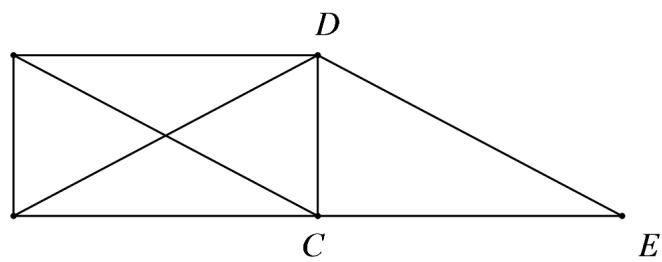

> [!faq]- 《专题02_平面向量的运算_高效培优期中专项训练_数学人教A版高一必修第》官方解析
>
> > [!success]- **【答案】** A. 2 B. 3 C. 4 D. 5
>
> > [!note]- **【解析】**
> > 解： $\vec{a}+\vec{b}+\vec{c}=\vec{AB}+\vec{BC}+\vec{BD}=\vec{AC}+\vec{BD}$
> >
> > 延长 BC 至 E，使 CE = BC，连接 DE，
> >
> > 
> >
> > 由于 $\vec{CE} = \vec{BC} = \vec{AD}$ ，∴ CE // AD, CE = AD，
> >
> > ∴ 四边形 ACED 是平行四边形，
> >
> > $$
> > \therefore \stackrel {\rightarrow} {A C} = \stackrel {\rightarrow} {D E}
> > $$
> >
> > $$
> > \therefore \stackrel {\rightarrow} {A C} + \stackrel {\rightarrow} {B D} = \stackrel {\rightarrow} {D E} + \stackrel {\rightarrow} {B D} = \stackrel {\rightarrow} {B E}
> > $$
> >
> > $$
> > \therefore \left| \stackrel {\rightarrow} {a + b + c} \right| = \left| \stackrel {\rightarrow} {B E} \right| = 2 \left| \stackrel {\rightarrow} {B C} \right| = 2 \left| \stackrel {\rightarrow} {A D} \right| = 4.
> > $$
> >
> > 故选 **C**
