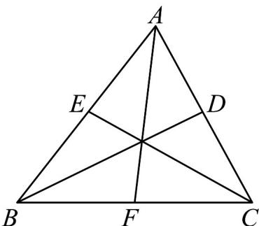

> [!faq]- 《专题02_平面向量的运算_高效培优期中专项训练_数学人教A版高一必修第》官方解析
>
> > [!success]- **【答案】** A
>
> > [!note]- **【解析】**
> > 如图，
> >
> > 
> >
> > $$
> > \square \square \square E C = \frac {1}{2} \left(\square \square \square A C + \square \square \square B C\right) \square \square \square F A = \frac {1}{2} \left(\square \square \square B C + \square \square \square B A\right) \quad \therefore \quad \square \square \square E C + \square \square \square F A = \frac {1}{2} \left(\square \square \square B C + \square \square \square B A\right) = \square \square \square B D
> > $$
> >
> > 故选 **A**
