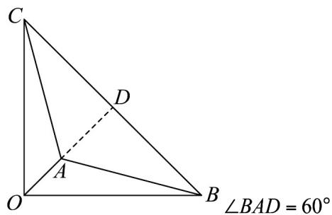

> [!faq]- 《专题02_平面向量的运算_高效培优期中专项训练_数学人教A版高一必修第》官方解析
>
> > [!success]- **【答案】** B
>
> > [!note]- **【解析】**
> > 作向量 $\overline{OA}=a,\overline{OB}=b,\overline{OC}=-c$ ，由 $b\perp c$ ， $|b|=|c|=\sqrt{2}$ ，得 $\triangle OBC$ 是腰长为 $\sqrt{2}$ 的等腰三角形， $|a-b|+|a|+|a+c|=|BA|+|OA|+|CA|$ ，而 $\triangle OBC$ 的所有内角均小于 $120^{\circ}$ ，
> > 因此 $|a-b|+|a|+|a+c|$ 取得最小值的点 A 是 $\triangle OBC$ 的费马点， $\angle BAC = \angle OAC = \angle OAB = 120^{\circ}$ ，则 AB = AC，点 A 在斜边 BC 的中线上，如图，
> >
> > 
> >
> > $$
> > A C = A B = 2 A D = B C \tan 3 0 ^ {\circ} = \frac {2 \sqrt {3}}{3}
> > $$
> >
> > $$
> > A O = A D - O D = 1 - \frac {\sqrt {3}}{3}
> > $$
> >
> > 所以 $|a - b| + |a| + |a + c|$ 的最小值为 $\frac{2\sqrt{3}}{3} + \frac{2\sqrt{3}}{3} + 1 - \frac{\sqrt{3}}{3} = \sqrt{3} + 1$ .
> >
> > 故选 **B**
