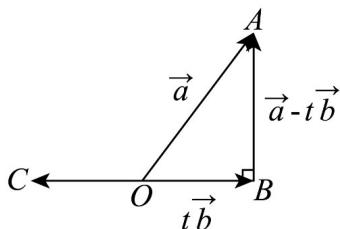

> [!faq]- 《专题02_平面向量的运算_高效培优期中专项训练_数学人教A版高一必修第》官方解析
>
> > [!success]- **【答案】** D
>
> > [!note]- **【解析】**
> > $\left|a-tb\right|$ 的几何意义如图所示，
> >
> > 因为 $\left|a-tb\right|$ 的最小值为 3，
> >
> > 所以在 Rt△AOB 中， $\left|OA\right|=2\sqrt{3},\left|AB\right|=3$ ，所以 $\sin\Phi AOB=\frac{3}{2\sqrt{3}}=\frac{\sqrt{3}}{2}$ ，
> >
> > 所以 $\angle AOB = \frac{\pi}{3}$
> >
> > 因为 $tb$ 与 $a$ 的夹角有两种情况，即 $q = < OA, OB>$ 或 $q = < OA, OC>$ ，所以 $\theta = \frac{\pi}{3}$ 或 $\frac{2\pi}{3}$ ，
> >
> > 故选：D.
> >
> > 
> >
> > 20. 四边形 $ABCD$ 中， $O$ 为任意一点，若 $OA - OB + OC - OD = 0$ ，则四边形 $ABCD$ 一定是（）A. 矩形 B. 菱形 C. 正方形 D. 平行四边形
> >
> > 【答案】D
> >
> > 【详解】因为 $OA - OB + OC - OD = 0$ ，则 $BA + DC = 0$ ，即 AB = DC，
> > 可知 AB, CD 两边平行且相等，所以四边形 ABCD 是平行四边形，
> > 但没有足够条件判断 ABCD 是否为矩形、菱形或正方形，故 ABC 错误，D 正确
> >
> > 故选 **D**.
