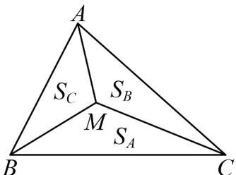
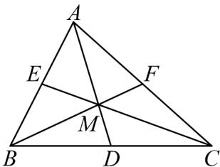
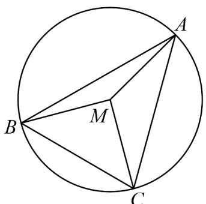
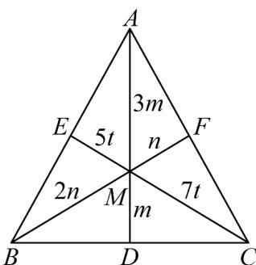
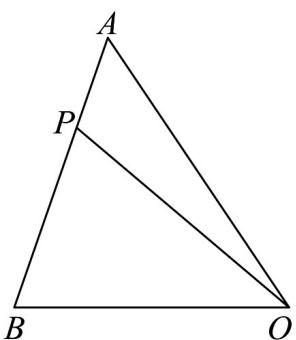

> [!faq]- 《专题02_平面向量的运算_高效培优期中专项训练_数学人教A版高一必修第》官方解析
>
> > [!success]- **【答案】**  A．若 $S_{A}:S_{B}:S_{C} = 1:1:1$ ，则 $M$ 为 $\triangle AMC$ 的重心 B．若 M 为 VABC 的内心，则 $BC \cdot MA + AC \cdot MB + AB \cdot MC = 0$ C．若 $\angle BAC = 45^{\circ}$ ， $\angle ABC = 60^{\circ}$ ，M 为 VABC 的外心，则 $S_{A}: S_{B}: S_{C} = \sqrt{3}: 2:1$ D. 若 $M$ 为 $\bigvee ABC$ 的垂心， $3MA + 4MB + 5MC = 0$ ，则 $\cos \angle AMB = -\frac{\sqrt{6}}{6}$
>
> > [!note]- **【解析】**
> > 对 A 选项，因为 $S_{A}:S_{B}:S_{C}=1:1:1$ ，所以 $MA+MB+MC=0$ ，
> >
> > 取 BC 的中点 D，则 $MB + MC = 2MD$ ，所以 $2MD = -MA$ ，
> >
> > 故 A, M, D 三点共线，且 $\left|MA\right|=2\left|MD\right|$
> >
> > 同理，取 $AB$ 中点 $E$ ， $AC$ 中点 $F$ ，可得 $B$ ， $M$ ， $F$ 三点共线， $C$ ， $M$ ， $E$ 三点共线，
> >
> > 所以 M 为 $\forall ABC$ 的重心， $^{A}$ 正确；
> >
> > 
> >
> > 对 $^{B}$ 选项，若M为VABC的内心，可设内切圆半径为r，
> >
> > 则 $S_{A} = \frac{1}{2} BC\cdot r$ ， $S_{B} = \frac{1}{2} AC\cdot r$ ， $S_{C} = \frac{1}{2} AB\cdot r$
> >
> > 所以 $\frac{1}{2} BC\cdot r\cdot MA + \frac{1}{2} AC\cdot r\cdot MB + \frac{1}{2} AB\cdot r\cdot MC = 0$
> >
> > 即 $BC \cdot MA + AC \cdot MB + AB \cdot MC = 0$ ，B 正确；
> >
> > 对 $C$ 选项，若 $\angle BAC = 45^{\circ}$ ， $\angle ABC = 60^{\circ}$ ， $M$ 为VABC的外心，则 $\angle ACB = 75^{\circ}$
> >
> > 设VABC的外接圆半径为R，故 $\angle BMC=2\angle BAC=90^{\circ}$ ， $\angle AMC=2\angle ABC=120^{\circ}$
> >
> > $$
> > \angle A M B = 2 \angle A C B = 1 5 0 ^ {\circ}
> > $$
> >
> > 故 $S_{A} = \frac{1}{2} R^{2}\sin 90^{\circ} = \frac{1}{2} R^{2}, S_{B} = \frac{1}{2} R^{2}\sin 120^{\circ} = \frac{\sqrt{3}}{4} R^{2}, S_{C} = \frac{1}{2} R^{2}\sin 150^{\circ} = \frac{1}{4} R^{2}$
> >
> > 所以 $S_{A}:S_{B}:S_{C}=2:\sqrt{3}:1$ ，C 错误；
> >
> > 
> >
> > 对 $^{D}$ 选项，若M为VABC的垂心， $3MA+4MB+5MC=0$
> >
> > 则 $S_{A}: S_{B}: S_{C} = 3:4:5$
> >
> > 004 007 711 052<|box\_end|><|ref\_start|>text<|ref\_end|><|rotate\_up|>
> > <|box\_start|>006 080 294 124<|box\_end|><|ref\_start|>text<|ref\_end|><|rotate\_up|>
> > <|box\_start|>007 154 456 232<|box\_end|><|ref\_start|>equation<|ref\_end|><|rotate\_up|>
> > <|box\_start|>007 269 450 348<|box\_end|><|ref\_start|>equation<|ref\_end|><|rotate\_up|>
> > <|box\_start|>007 383 405 460<|box\_end|><|ref\_start|>equation<|ref\_end|><|rotate\_up|>
> > <|box\_start|>006 500 871 540<|box\_end|><|ref\_start|>text<|ref\_end|><|rotate\_up|>
> > <|box\_start|>006 577 694 641<|box\_end|><|ref\_start|>text<|ref\_end|><|rotate\_up|>
> > <|box\_start|>006 676 369 753<|box\_end|><|ref\_start|>text<|ref\_end|><|rotate\_up|>
> > <|box\_start|>006 790 987 901<|box\_end|><|ref\_start|>equation<|ref\_end|><|rotate\_up|>
> > <|box\_start|>006 949 150 987<|box\_end|><|ref\_start|>text<|ref\_end|><|rotate\_up|>
> >
> > 
> >
> > 31. △ OAB，点 P 在边 AB 上， $\overline{AB}=3\overline{AP}$ ，设 $\overline{OA}=a,\overline{OB}=b$ ，则 $\overline{OP}$ （）
> >
> > 【答案】
> > A. $\frac{1}{3}a + \frac{2}{3}b$ B. $\frac{2}{3}a + \frac{1}{3}b$ C. $\frac{1}{3}a - \frac{2}{3}b$ D. $\frac{2}{3}a - \frac{1}{3}b$
> >
> > 【答案】B 【详解】
> >
> > 
> >
> > 依题意， $OP = OA + AP = OA + \frac{1}{3} AB = OA + \frac{1}{3}\left(OB - OA\right) = \frac{2}{3}OA + \frac{1}{3}OB = \frac{2}{3}a + \frac{1}{3}b$ .
> >
> > 答案：B.
