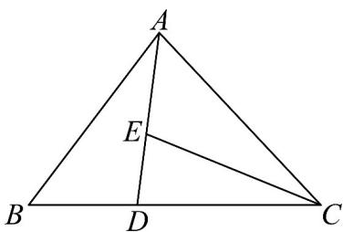

> [!faq]- 《专题02_平面向量的运算_高效培优期中专项训练_数学人教A版高一必修第》官方解析
>
> > [!success]- **【答案】** 13
>
> > [!note]- **【解析】**
> > 因为 $\overline{BD}=\frac{1}{3}\overline{BC}$ ，所以 $\overline{CB}=\frac{3}{2}\overline{CD}$
> >
> > 因为 $\overline{CE} = x\overline{CA} +y\overline{CB}$ ，所以 $CE = xCA + \frac{3}{2} yCD$
> >
> > 因为 $A, D, E$ 三点共线，所以 $x + \frac{3}{2} y = 1$ ， $x > 0, y > 0$ ， $\frac{2x + 3y + xy}{xy} = \frac{2}{y} + \frac{3}{x} + 1 = \left(\frac{2}{y} + \frac{3}{x}\right) \left(x + \frac{3}{2} y\right) + 1$ $= \frac{2x}{y} + 3 + 3 + \frac{9y}{2x} + 1 = 7 + \frac{2x}{y} + \frac{9y}{2x} - 7 + 2\sqrt{\frac{2x}{y} \cdot \frac{9y}{2x}} = 13$ 当且仅当 $\left\{\begin{aligned}\frac{2x}{y}&=\frac{9y}{2x}\\ x+\frac{3}{2}y&=1\end{aligned}\right.$ ，即 $\left\{\begin{aligned}x&=\frac{1}{2}\\ y&=\frac{1}{3}\end{aligned}\right.$ 时取等.
> >
> > 故答案为：13.
> >
> > 
