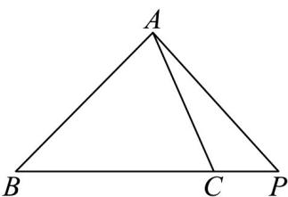

> [!faq]- 《专题02_平面向量的运算_高效培优期中专项训练_数学人教A版高一必修第》官方解析
>
> > [!success]- **【答案】** A. $AP = -\frac{1}{3} AB + \frac{4}{3} AC$ B. $AP = \frac{1}{4} AB + \frac{1}{2} AC$ C. $AP = \frac{4}{3} AB - \frac{1}{2} AC$ D. $AP = \frac{3}{4} AB + \frac{1}{2} AC$
>
> > [!note]- **【解析】**
> > 由题意作出图形，如图所示，
> >
> > 
> >
> > 所以 $AP = AC + CP = AC + \frac{1}{3} BC = AC + \frac{1}{3}(AC - AB) = -\frac{1}{3} AB + \frac{4}{3} AC$
> >
> > 故选 **A**.
