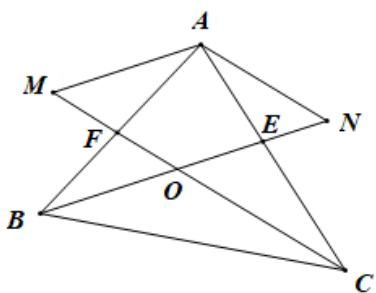
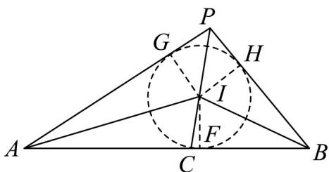

> [!faq]- 《专题02_平面向量的运算_高效培优期中专项训练_数学人教A版高一必修第》官方解析
>
> > [!success]- **【答案】** A. $O$ 为 $\forall ABC$ 的外心 $\Leftrightarrow |\overline{OA}| = |\overline{OB}| = |\overline{OC}| = \frac{a}{\sin A}$ B. $O$ 为 $\forall ABC$ 的重心 $\Leftrightarrow \overline{OA} + \overline{OB} + \overline{OC} = 0$ C. $O$ 为 $\forall ABC$ 的垂心 $\Leftrightarrow \overline{OA} \cdot \overline{OB} = \overline{OB} \cdot \overline{OC} = \overline{OC} \cdot \overline{OA}$ D. $O$ 为 $\forall ABC$ 的内心 $\Leftrightarrow a\overline{OA} + b\overline{OB} + c\overline{OC} = 0$
>
> > [!note]- **【解析】**
> > A. 当 O 为三角形的外心，由正弦定理可得： $\left|\overline{OA}\right|=\left|\overline{OB}\right|=\left|\overline{OC}\right|=\frac{a}{2\sin A}$ ，故 A 错误；
> >
> > B. 当 O 为三角形的重心，O 为中线的交点，延长 AO 交 BC 于点 M，可得 $\left|AO\right|=2\left|OM\right|$ ，所以 $AO=2OM=OB+OC,\therefore OA+OB+OC=0$ .
> >
> > 反之，取 BC 中点 M，若 $OA + OB + OC = 0$ ，则 $OA + 2OM = 0$ ，则可得 A, O, M 三点共线且 $\left|OA\right| = 2\left|OM\right|$ ，即 A 为三角形的重心·故 B 正确；
> >
> > C. 当 O 为三角形的垂心， $OA \perp BC \Rightarrow OAgBC = 0 \Rightarrow OAg(OC - OB) = 0 \Rightarrow OAgOC = OAgOB$ ，同理可证 $OBgOC = OAgOB$ ，即 $OA\square OB = OB\square OC = OC\square OA$ ，反之也成立，故 C 正确；
> >
> > D. 当 $O$ 为三角形的内心， $\mathrm{O}$ 为三角形的角平分线，则 $\frac{b}{a} = \frac{|AF|}{|BF|}, \frac{c}{a} = \frac{|AE|}{|CE|}$ ，如图过 $A$ 作 $CF$ 的平行线交 $BE$ 的延长线于点 $N$ ，过 $A$ 作 $BE$ 的平行线交 $CF$ 于点 $M$ ，则四边形 $AMON$ 为平行四边形
> >
> > 
> >
> > $$
> > \underset {O A} {\mathbf {u r}} = \underset {O M} {\mathbf {u u r}} + \underset {O N} {\mathbf {u u u}} = \frac {\left| \underset {C O} {\mathbf {u u u}} \right|}{\left| \underset {C O} {\mathbf {u u u}} \right|} \underset {g C O} {\mathbf {u u u}} + \frac {\left| \underset {B O} {\mathbf {u u u}} \right|}{\left| \underset {B O} {\mathbf {u u u}} \right|} \underset {g B O} {\mathbf {u u u}} = \frac {\left| A E \right|}{\left| C E \right|} \underset {g C O} {\mathbf {u u u}} + \frac {\left| A F \right|}{\left| B F \right|} \underset {g B O} {\mathbf {u u u}} = \frac {c}{a} \underset {g C O} {\mathbf {u u u}} + \frac {b}{a} \underset {g B O} {\mathbf {u u u}}
> > $$
> >
> > 所以 $aOA - cCO - bBO = 0 \Rightarrow aOA + cOC + bOB = 0$ ，反之也成立，故D正确；
> >
> > 故选：BCD
> >
> > $$
> > C
> > $$
> >
> > $$
> > A B \text {上一点，} P
> > $$
> >
> > $$
> > P C \text {   是   } \angle A P B
> > $$
> >
> > $$
> > P C _ {\mathrm{上一点}}
> > $$
> >
> > $\frac{\square\square}{\square B I}=\frac{\square\square}{\square B A}+\lambda\left(\frac{\square\square}{\square A C}\right)+\frac{\square\square}{\square A P}\left(\lambda>0\right)$ ， $\left|\overline{P A}\right|-\left|\overline{P B}\right|=4$ ， $\left|\overline{P A}-\overline{P B}\right|=10$ ，则 $\frac{\square\square}{\square B A}\cdot\frac{\square\square}{\square B A}$ 的值为\_\_\_\_.
> >
> > 【答案】 $^{3}$
> >
> > 【详解】 $\frac{\square\square}{BI}=\frac{\square\square}{BA}+\lambda\left(\frac{\square\square}{AC}\right)+\frac{\square\square}{AP}\left(\lambda>0\right)$ ，即 $\overrightarrow{AI}=\lambda\left(\frac{\square\square}{AC}\right)+\frac{\square\square}{AP}\left(\frac{\square\square}{AC}\right)$ ，表示 在 $\angle PAB$ 的角平分线上，故 $I$ 是 $\Delta PAB$ 内心.
> >
> > 如图所示： $\left|\overline{A}F\right|-\left|\overline{B}F\right|=\left|\overline{A}G\right|-\left|\overline{B}H\right|=\left|\overline{A}P\right|-\left|\overline{B}P\right|=4$ ； $\left|\overline{A}F\right|+\left|\overline{B}F\right|=10$ ，故 $\left|\overline{B}F\right|=3$ 。
> >
> > $$
> > \frac {\square \square \square \square \square B I \cdot \square B A}{| B A |} = \frac {| B I | \cdot | B A | \cos \angle A B I}{| B A |} = | \overrightarrow {B F} | = 3
> > $$
> >
> > 故答案为：3·
> >
> > 
