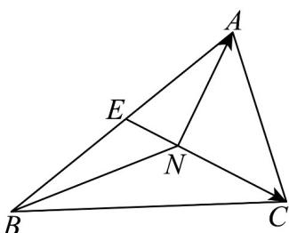
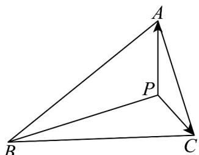

> [!faq]- 《专题02_平面向量的运算_高效培优期中专项训练_数学人教A版高一必修第》官方解析
>
> > [!success]- **【答案】** A. 垂心，外心，内心 B. 重心，外心，内心 C. 重心，垂心，外心 D. 重心，垂心，内心
>
> > [!note]- **【解析】**
> > 
> >
> > 由 $NA + NB + NC = 0$ ，则 $NA + NB = -NC$
> >
> > 取 AB 的中点 E，则 $NA + NB = -2NE = CN$ ，
> >
> > 所以 $2\left|\overline{NE}\right|=\left|\overline{CN}\right|$ ，所以 N 是 VABC 的重心；
> >
> > 
> >
> > 由 $\overline{PA} \cdot \overline{PB} = \overline{PB} \cdot \overline{PC} = \overline{PC} \cdot \overline{PA}$ ，得 $(PA - PC) \cdot \overline{PB} = 0$ ，即 $AC \cdot \overline{PB} = 0$
> >
> > 所以 $AC \perp PB$ ，同理 $AB \perp PC$ ，所以点 P 为 $\forall ABC$ 的垂心.
> >
> > 由 $\overrightarrow{OA}\cdot\left(\frac{\overrightarrow{AB}}{|AB|}+\frac{\overrightarrow{CA}}{|CA|}\right)=0$ ，得 $\frac{\overrightarrow{OA}\cdot\overrightarrow{AB}}{|AB|}=\frac{\overrightarrow{OA}\cdot\overrightarrow{AC}}{|CA|}$ ，则 $\cos\angle OAB=\cos\angle OAC$
> >
> > 而点 $O$ 在 $\forall ABC$ 内，则 $\angle OAB, \angle OAC \in (0, \pi)$ ，即 $\angle OAB = \angle OAC$ ，因此 $OA$ 平分角 $\angle BAC$
> >
> > 同理 OB, OC 分别平分 $\angle ABC, \angle ACB$ ，从而点 O 是 VABC 的内心，
> >
> > 故选：D
> >
> > 48. 点 在 所在的平面内，若 $\overrightarrow{OA} = \lambda \left( \begin{array}{c} \overrightarrow{AC} + \overrightarrow{AB} \\ \overrightarrow{|AC|} + \overrightarrow{|AB|} \end{array} \right) (\lambda \neq 0)$ ，则直线 一定经过 的 \_\_\_\_。
> >
> > 【答案】
> >
> > (填:重心、内心、外心或垂心)
> >
> > 【答案】内心
> >
> > 【详解】 $\frac{A C}{|A C|}, \frac{A B}{|A B|}$ 分别表示 $AC, AB$ 同方向的单位向量，
> >
> > 故 $\frac{\boxed{A}\boxed{C}}{\boxed{AC}} +\frac{\boxed{AB}}{\boxed{AB}}$ 平分 $\angle BAC$ ，即 $\frac{\boxed{OA}}{\angle BAC}$ 平分
> >
> > 所以直线 OA 一定经过 $\vee ABC$ 的内心.
> >
> > 故答案为:内心·
