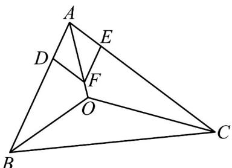
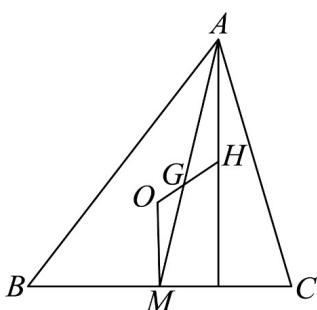

> [!faq]- 《专题02_平面向量的运算_高效培优期中专项训练_数学人教A版高一必修第》官方解析
>
> > [!success]- **【答案】** A. 外心 B. 内心 C. 重心 D. 垂心
>
> > [!note]- **【解析】**
> > 在 $AB$ ， $AC$ 上分别取点 $D$ ， $E$ ，使得 $\vec{AD} = \frac{\vec{AB}}{c}$ ， $\vec{AE} = \frac{\vec{AC}}{b}$ ，则 $\left|\overrightarrow{AD}\right| = \left|\overrightarrow{AE}\right| = 1$ 以 $AD$ ， $AE$ 为邻边作平行四边形 $ADFE$ ，如图，
> >
> > 
> >
> > 则四边形 $_{ADF}$ 是菱形，且 $\vec{AF} = \vec{AD} + \vec{AE} = \frac{\vec{AB}}{c} + \frac{\vec{AC}}{b}$
> >
> > $\therefore AF$ 为 $\angle BAC$ 的平分线． $\because a\overrightarrow{OA} +b\overrightarrow{OB} +c\overrightarrow{OC} = \overrightarrow{0}$
> >
> > $$
> > \therefore a \cdot \overrightarrow {O A} + b \cdot (\overrightarrow {O A} + \overrightarrow {A B}) + c \cdot (\overrightarrow {O A} + \overrightarrow {A C}) = \overrightarrow {0}
> > $$
> >
> > 即 $(a+b+c)\vec{OA}+b\vec{AB}+c\vec{AC}=\vec{0}$ ，
> >
> > $\therefore AO=\frac{b}{a+b+c}AB+\frac{c}{a+b+c}AC=\frac{bc}{a+b+c}\left(\frac{AB}{c}+\frac{AC}{b}\right)=\frac{bc}{a+b+c}AF$ ∴ A, O, F 三点共线，即 O 在 $\angle BAC$ 的平分线上，
> > 同理可得 O 在其它两角的平分线上，
> > ∴ O 是 ∨ ABC 的内心.
> > 故选：B.
> >
> > 52. 数学家欧拉在 $^{1765}$ 年提出定理：三角形的外心、重心、垂心依次位于同一直线上，且重心到外心的距离是重心到垂心距离的一半·这条直线被后人称为三角形的欧拉线，该定理则被称为欧拉线定理·设点O,G,H分别为三角形ABC的外心、重心、垂心，且M为BC的中点，则（）A. $AH = 2OM$ B. $GA + GB + GC = 0$ C. $\left|OA\right| = \left|OB\right| = \left|OC\right|$ D. $AG = \frac{1}{3}AO + \frac{2}{3}AH$
> >
> > 【答案】ABC
> >
> > 【详解】
> >
> > 
> >
> > 对于 $^{A}$ ，由M是BC的中点，又由O是外心，H是垂心，可知： $OM\perp BC, AH\perp BC,$ 所以 $OM // AH$ ，根据平行线分线段成比例可知： $\frac{OM}{AH}=\frac{OG}{GH}$ 又由欧拉线的性质可知： $OG=\frac{1}{2}GH$ ，所以 $\frac{OM}{AH}=\frac{1}{2}$ ，即 $AH=2OM$ ，故 $^{A}$ 正确；
> > 对于 $^{B}$ ，由于G是重心，所以 $2GM+GA=0$ ，
> > 而 M 是 BC 的中点，所以 $GM = \frac{1}{2} GB + \frac{1}{2} GC$ ，代入上式可得： $GB + GC + GA = 0$ ，故 $^{B}$ 正确；
> > 对于 $^{C}$ ，因为O是外心，所以 $\left|OA\right|=\left|OB\right|=\left|OC\right|$ ，故 $^{C}$ 正确；
> >
> > 对于 D，由向量的加法可知： $AG = AH + HG = AH + \frac{2}{3} HO = AH + \frac{2}{3}(AO - AH) = \frac{2}{3} AO + \frac{1}{3} AH$ ，故 D 错误；
> >
> > 故选 **ABC**.
