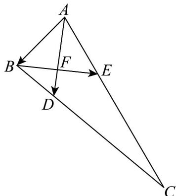

<!-- question-source:start -->
17. 如图，在 $VABC$ 中， $AB = 2$ ， $AC = 6$ ，且 $CD = 3DB$ ， $AC = 3AE$ ， $F$ 是 $AD$ 和 $BE$ 的交点。

(1)用 $AB$ ， $AC$ 表示 $BE$ ， $AD$ 。

(2)证明： $AD\perp BE$

(3)证明： $F$ 是线段 $BE$ 的中点.
<!-- question-source:end -->

![[高中/课堂同步/题库/人教A版高中数学同步讲义(2026)/02_必修第二册/期中专项训练+期中模拟卷/专项训练/专题03_向量的数量积_高效培优期中专项训练_数学人教A版高一必修第二/_compact/answers/Q00063822A1.md]]
