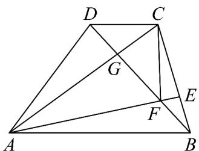

> [!faq]- 《专题03_向量的数量积_高效培优期中专项训练_数学人教A版高一必修第二》官方解析
>
> > [!success]- **【答案】** (1) $\overline{CB}=\frac{5}{8}\overline{AB}-\overline{AD}$ ， $\overline{AE}=\frac{19}{24}\overline{AB}+\frac{1}{3}\overline{AD}$ (2) $x = \frac{1}{2}$ .
>
> > [!note]- **【解析】**
> > （1）依题意 $CB = CD + DA + AB = -\frac{3}{8}AB - AD + AB = \frac{5}{8}AB - AD$
> >
> > $\overline{AE}=\overline{AB}+\overline{BE}=\overline{AB}-\frac{1}{3}\overline{CB}=\overline{AB}-\frac{1}{3}\left(\frac{5}{8}\overline{AB}-\overline{AD}\right)=\frac{19}{24}\overline{AB}+\frac{1}{3}\overline{AD}$
> >
> > (2) 因为 $DF = xDB = x\left(AB - AD\right)$
> >
> > 所以 $CF = CD + DF = \left(x - \frac{3}{8}\right) AB - x AD$
> >
> > 所以 $\overrightarrow{CF}^2 = \left(x - \frac{3}{8}\right)^2\overrightarrow{AB}^2 +x^2\overrightarrow{AD}^2 -2x\left(x - \frac{3}{8}\right)\overrightarrow{AB}\cdot \overrightarrow{AD}$
> >
> > 因为 $\cos\angle DAB=\frac{1}{3}$ ，所以 $AB\cdot AD=6\times8\times\frac{1}{3}=16$
> >
> > 所以 $8 = 64\left(x - \frac{3}{8}\right)x^{2} + 36x^{2} - 32\left(x - \frac{3}{8}\right)$ ，即 $68x^{2} - 36x + 1 = 0$ ，解得 $x = \frac{1}{2}$ 或 $\frac{1}{34}$ 。
> >
> > 连接 $AC$ 交 $BD$ 于 $G$ ，因为 $AB//CD$ ，所以 $\triangle ABG \sim \triangle CDG$ ，所以 $\frac{DG}{BG} = \frac{CD}{AB} = \frac{3}{8}$
> >
> > 则 $\overline{DG}=\frac{3}{11}\overline{DB}$
> >
> > 因为 $E$ 在线段 $BC$ 上，所以 $\frac{3}{11} < x < 1$ ，故 $x = \frac{1}{2}$
> >
> > 
