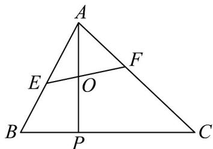

<!-- question-source:start -->
6. 如图，在 $\mathrm{V}ABC$ 中，点 $P$ 满足 $PC = 2BP$ ， $O$ 是线段 $AP$ 的中点，过点 $O$ 的直线与线段 $AB, AC$ 分别交于点 $E, F$ ：

(1)若 $\overline{AE}=\frac{2}{3}\overline{AB}$ ，请用向量 $\overline{AB},\overline{AC}$ 来表示向量 $\overline{AO},\overline{EO}$ ；

(2)若 $AE = \lambda AB(0\leq \lambda \leq 1),AF = \mu AC(0\leq \mu \leq 1)$ ，求 $2\lambda +\mu$ 的最小值.
<!-- question-source:end -->

![[高中/课堂同步/题库/人教A版高中数学同步讲义(2026)/02_必修第二册/期中专项训练+期中模拟卷/专项训练/专题04_平面向量基本定理及坐标表示_高效培优期中专项训练_数学人教A/_compact/answers/Q00063845A1.md]]
