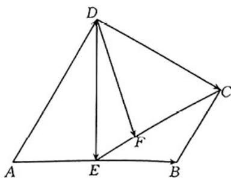

<!-- question-source:start -->
7. 如图，在四边形 $ABCD$ 中， $AD \parallel BC, AD = 2BC, E$ 是 $AB$ 的中点.

(1)用向量 $AB, AD$ 表示向量 $DE, DC$ ;

(2)若 F 为 EC 上一点，且 $\overline{DF} = x\overline{AB} + y\overline{AD}$ ，求 x - y 的值.
<!-- question-source:end -->

![[高中/课堂同步/题库/人教A版高中数学同步讲义(2026)/02_必修第二册/期中专项训练+期中模拟卷/专项训练/专题04_平面向量基本定理及坐标表示_高效培优期中专项训练_数学人教A/_compact/answers/Q00063846A1.md]]
