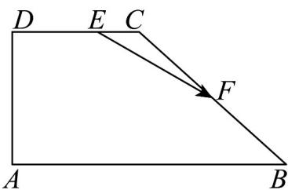

<!-- question-source:start -->
8. 在直角梯形 $ABCD$ 中， $AB // CD$ ， $\angle DAB = 90^\circ$ ， $AB = 2AD = 2DC = 4$ ，点 $F$ 是 $BC$ 边上的中点。

(1)若点 E 满足 $\overline{DE} = 2\overline{EC}$ ，且 $\overline{EF} = \lambda\overline{AB} + \mu\overline{AD}$ ，求 $6\lambda + \mu$ 的值；

(2)若点 P 是线段 AF 上的动点（含端点），求 $AP \cdot DP$ 的取值范围.
<!-- question-source:end -->

![[高中/课堂同步/题库/人教A版高中数学同步讲义(2026)/02_必修第二册/期中专项训练+期中模拟卷/专项训练/专题04_平面向量基本定理及坐标表示_高效培优期中专项训练_数学人教A/_compact/answers/Q00063847A1.md]]
