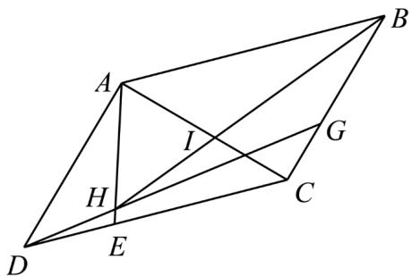

<!-- question-source:start -->
24. 如图，在平行四边形 $ABCD$ 中， $AD \perp AC$ ， $E$ 为 $\mathbf{DC}$ 上靠近 $D$ 的三等分点， $G$ 为 $BC$ 上靠近 $C$ 的三等分点，且 $HI:IB$ 恰为 3:5，若以 $A$ 为原点， $AC$ 为 $x$ 轴， $AD$ 为 $y$ 轴， $\overline{AC}$ ， $\overline{AD}$ 为基底。

(1)求 $AH$ 坐标；

(2)求 $\stackrel{\square\square}{AI}$ 坐标.
<!-- question-source:end -->

![[高中/课堂同步/题库/人教A版高中数学同步讲义(2026)/02_必修第二册/期中专项训练+期中模拟卷/专项训练/专题04_平面向量基本定理及坐标表示_高效培优期中专项训练_数学人教A/_compact/answers/Q00063862A1.md]]
