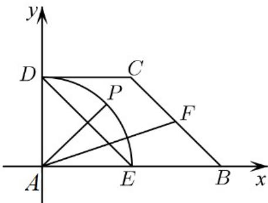

<!-- question-source:start -->
45. 在直角梯形 $ABCD$ 中， $AB \perp AD$ ， $DC \parallel AB$ ， $AD = DC = 1$ ， $AB = 2$ ， $E$ ， $F$ 分别为 $AB$ ， $BC$ 的中点，点 $P$ 在以 $A$ 为圆心的圆弧 $DE$ 上运动，若 $AP = xED + yAF$ ，求 $2x - y$ 的取值范围。

<!-- question-source:end -->

![[高中/课堂同步/题库/人教A版高中数学同步讲义(2026)/02_必修第二册/期中专项训练+期中模拟卷/专项训练/专题04_平面向量基本定理及坐标表示_高效培优期中专项训练_数学人教A/_compact/answers/Q00063882A1.md]]
