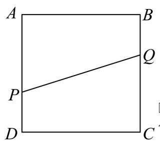
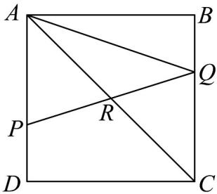

> [!faq]- 《专题04_平面向量基本定理及坐标表示_高效培优期中专项训练_数学人教A》官方解析
>
> > [!success]- **【答案】** (1) $PQ = -\frac{1}{3}a + b$ (2) $\lambda = \frac{1}{2}$
>
> > [!note]- **【解析】**
> > （1）
> >
> > 
> >
> > $PQ=PA+AB+BQ=-\frac{2}{3}AD+AB+\frac{1}{3}AD=-\frac{1}{3}AD+AB=-\frac{1}{3}a+b$
> >
> > (2)
> >
> > 
> >
> > 由题意 $AR = \lambda AP + (1 - \lambda) AQ = \lambda \cdot \frac{2}{3} AD + (1 - \lambda) \left( AB + \frac{1}{3} AD \right) = (1 - \lambda) AB + \frac{1}{3} (1 + \lambda) AD$ ，设 $AR = k AC = k AB + k AD$ ，
> > 因为 AB, AD 不共线，
> > 从而 $1-\lambda=\frac{1}{3}(1+\lambda)$ ，解得 $\lambda=\frac{1}{2}$ .
