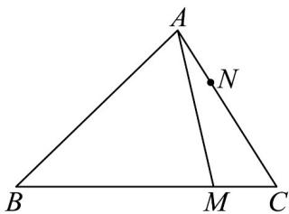

> [!faq]- 《专题04_平面向量基本定理及坐标表示_高效培优期中专项训练_数学人教A》官方解析
>
> > [!success]- **【答案】** $\frac{2}{9}$
>
> > [!note]- **【解析】**
> > 由题得 $AM = AB + BM = AB + \frac{3}{4} BC = AB + \frac{3}{4}(AC - AB) = \frac{3}{4} AC + \frac{1}{4} AB$ ，
> > 所以 $AN = \lambda AB + \mu AM = \left( \lambda + \frac{1}{4} \mu \right) AB + \frac{3}{4} \mu AC$
> >
> > 又 $\frac{1}{AN} = \frac{1}{3} \frac{1}{AC}$ ，所以 $\left\{ \begin{array}{l} \lambda + \frac{1}{4} \mu = 0 \\ \frac{3}{4} \mu = \frac{1}{3} \end{array} \right.$ ，所以 $\lambda = -\frac{1}{9}, \mu = \frac{4}{9}$ ，
> >
> > 所以 $2\lambda + \mu = -\frac{2}{9} + \frac{4}{9} = \frac{2}{9}$
> >
> > 
> >
> > 故答案为： $\frac{2}{9}$
