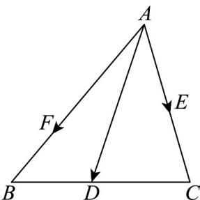

> [!faq]- 《专题04_平面向量基本定理及坐标表示_高效培优期中专项训练_数学人教A》官方解析
>
> > [!success]- **【答案】** 8
>
> > [!note]- **【解析】**
> > 因为点 $E$ 为线段 $AC$ 的中点， $\overline{AF} = 2FB$ ，所以 $\overline{AE} = \frac{1}{2} \overline{AC}$ ， $\overline{AF} = \frac{2}{3} AB$
> >
> > 
> >
> > 所以 $AD = mAE + nAF = \frac{1}{2}mAC + \frac{2}{3}nAB$
> >
> > 又因为 D 在线段 BC 上，
> >
> > 所以有 $\overline{BD} = \lambda \overline{BC} \Rightarrow \overline{AD} - \overline{AB} = \lambda \left( \overline{AC} - \overline{AB} \right) \Rightarrow \overline{AD} = \lambda \overline{AC} + (1 - \lambda) \overline{AB}$ 且 $\lambda \in (0,1)$
> >
> > 根据平面向量基本定理可知： $\left\{\begin{aligned}\frac{1}{2}m&=\lambda\\\frac{2}{3}n&=1-\lambda\end{aligned}\right.$
> >
> > 所以有 $\frac{1}{2} m + \frac{2}{3} n = 1$ ，且 $\frac{1}{2} m, \frac{2}{3} n \in (0,1)$ ，即 $m \in (0,2), n \in \left(0, \frac{3}{2}\right)$
> >
> > $$
> > \frac {4}{m} + \frac {3}{n} = \left(\frac {4}{m} + \frac {3}{n}\right) \left(\frac {1}{2} m + \frac {2}{3} n\right) = 2 + 2 + \frac {8 n}{3 m} + \frac {3 m}{2 n} \quad 4 + 2 \sqrt {\frac {8 n}{3 m} \cdot \frac {3 m}{2 n}} = 8
> > $$
> >
> > 当且仅当 $\frac{8n}{3m} = \frac{3m}{2n}$ ，即 $m = 1$ ， $n = \frac{3}{4}$ 时取等号，
> >
> > 故答案为：8.
