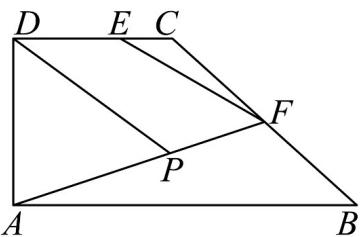

> [!faq]- 《专题04_平面向量基本定理及坐标表示_高效培优期中专项训练_数学人教A》官方解析
>
> > [!success]- **【答案】** (1)2； (2) $\left[-\frac{1}{10},8\right]$ .
>
> > [!note]- **【解析】**
> > （1）由 $EF = EC + CF = \frac{1}{3} DC + \frac{1}{2} CB = \frac{1}{6} AB + \frac{1}{2}(CD + DA + AB) = \frac{1}{6} AB + \frac{1}{2} (\frac{1}{2} AB - AD) = \frac{5}{12} AB - \frac{1}{2} AD$ ，
> >
> > 又 $EF=\lambda AB+\mu AD$ ，即 $\lambda=\frac{5}{12},\mu=-\frac{1}{2}$ ，故 $6\lambda+\mu=2$ ；
> >
> > (2) 如下图，令 $AP = \nu AF = \nu (AB + BF) = \nu (AB + \frac{1}{2} BC)$ 且 $0 \leq \nu \leq 1$
> >
> > $$
> > A P = \nu (A B + \frac {1}{2} B A + \frac {1}{2} A D + \frac {1}{2} D C) = \frac {3 \nu}{4} A B + \frac {\nu}{2} A D
> > $$
> >
> > $$
> > D P = D A + A P = \nu \left(\frac {3}{4} A B + \frac {1}{2} A D\right) - A D = \frac {3 \nu}{4} A B + \left(\frac {\nu}{2} - 1\right) A D
> > $$
> >
> > $$
> > \underset {A P} {\square \square} \cdot \underset {D P} {\square \square} = \left(\frac {3 \nu}{4} A B + \frac {\nu}{2} A D\right) \cdot \left[ \frac {3 \nu}{4} A B + \left(\frac {\nu}{2} - 1\right) A D \right] = \frac {9 \nu^ {2}}{1 6} A B ^ {2} + \frac {3 \nu}{4} (\nu - 1) A B \cdot A D + \frac {\nu}{2} \left(\frac {\nu}{2} - 1\right) A D ^ {2} =
> > $$
> >
> > $$
> > 9 \nu^ {2} + \nu (\nu - 2) = 1 0 \left(\nu - \frac {1}{1 0}\right) ^ {2} - \frac {1}{1 0},
> > $$
> >
> > 所以 $AP \cdot DP \in [-\frac{1}{10}, 8]$ .
> >
> > 
