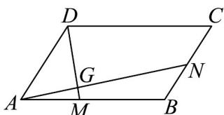

> [!faq]- 《专题04_平面向量基本定理及坐标表示_高效培优期中专项训练_数学人教A》官方解析
>
> > [!success]- **【答案】** (1) $\overline{DM} = \frac{2}{3} AB - AD$ ， $\overline{AN} = \overline{AB} + \frac{1}{3} AD$ ; (2) $\frac{\left|\begin{matrix}\square\square\square\\AG\\\square\square\square\\AN\end{matrix}\right|}{\left|\begin{matrix}5\\5\end{matrix}\right|}=\frac{2}{5}$ ; (3) $(-2,3)$ .
>
> > [!note]- **【解析】**
> > （1）由题设 $DM = AM - AD = \frac{2}{3} AB - AD$ ， $AN = AB + BN = AB + \frac{1}{3} AD$
> >
> > 
> >
> > (2) 由 $D$ ， $G$ ， $M$ 三点共线， $\overline{AG} = \lambda_1 \overline{AM} + \lambda_2 \overline{AD} (\lambda_1 + \lambda_2 = 1)$ ， $\overline{AG} = \frac{\lambda_1}{2} AB + \lambda_2 AD$
> >
> > 由 $AN = AB + \frac{1}{2} AD$ ，若 $AG = kAN$ ，则 $kAN = \frac{\lambda_1}{2} AB + \lambda_2AD$
> >
> > $\therefore AN = \frac{\lambda_1}{2k} AB + \frac{\lambda_2}{k} AD, \frac{\lambda_1}{2k} = 1, \frac{\lambda_2}{k} = \frac{1}{2},$
> >
> > ∵ $\lambda_{1} + \lambda_{2} = 1$ ，解得 $k = \frac{2}{5}$ ，所以 $\frac{\left|\overline{AG}\right|}{\left|AN\right|} = \frac{2}{5}$ ;
> >
> > (3) $AN \cdot DM = (AB + \mu AD) \cdot (\lambda AB - AD)$
> >
> > $$
> > = \lambda A B ^ {2} + \lambda \mu A B \cdot A D - A D \cdot A B - \mu A D ^ {2}
> > $$
> >
> > $$
> > = 4 \lambda + \lambda \mu - 1 - \mu = 4 \lambda + \lambda (1 - \lambda) - 1 - 1 + \lambda
> > $$
> >
> > $$
> > = - \lambda^ {2} + 6 \lambda - 2 = - (\lambda - 3) ^ {2} + 7
> > $$
> >
> > $$
> > \mathrm{Q} 0 <   \lambda <   1
> > $$
> >
> > $$
> > \therefore A N \cdot D M \in (- 2, 3)
> > $$
