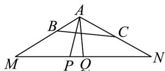
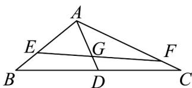

> [!faq]- 《专题04_平面向量基本定理及坐标表示_高效培优期中专项训练_数学人教A》官方解析
>
> > [!success]- **【答案】** $\frac{2\pi}{3} / \frac{2}{3}\pi$ $\left[\frac{2}{3}, \frac{11}{6}\right]$
>
> > [!note]- **【解析】**
> > - **①**：令 $AP = 3\lambda AB + 2(1 - \lambda)AC$ ， $AM = 3AB, AN = 2AC$
> >
> > 则 $AP = \lambda AM + (1 - \lambda)AN$
> >
> > 即 $AP - AN = \lambda (AM - AN)$
> >
> > 所以 $NP = \lambda NM$ ，即点 P 在直线 MN 上。
> >
> > 
> >
> > 设 $MN$ 的中点为 $\mathbb{Q}$ ，因为 $AM = AN = 6$ ，所以 $AQ \perp MN$
> >
> > 因为 $AQ = \left|\overline{AP}\right|_{\min} = 3$ ， $\cos \angle MAQ = \frac{AQ}{AM} = \frac{1}{2}$ ，∴ $\angle MAQ = \frac{\pi}{3}$
> >
> > 所以 $\angle BAC = 2\angle MAQ = \frac{2\pi}{3}$
> > - **②**：设 $\left\{\begin{array}{l} \square\square\square\square \\ AG = \mu AD \\ \square\square\square\square \\ AE = mAB \\ \square\square\square\square \\ AF = nAC \end{array}\right.$ ，由向量共线的充要条件不妨设 $AG = xAE + yAF(x + y = 1)$ ,
> >
> > 则 $AG = xAE + yAF = xmAB + ynAC,$
> >
> > $$
> > A G = \mu A D = \frac {\mu}{2} \left(A B + A C\right) = \frac {\mu}{2} A B + \frac {\mu}{2} A C,
> > $$
> >
> > 则 $xm = yn = \frac{\mu}{2}$ ，即 $\frac{\mu}{2m} +\frac{\mu}{2n} = 1$
> >
> > 又的面积为面积的一半，得 $\frac{\frac{1}{2}\times\sin 120^{\circ}\cdot AE\cdot AF}{\frac{1}{2}\times\sin 120^{\circ}\cdot AB\cdot AC}=\frac{1}{2},\therefore mn=\frac{1}{2},$ △AEF VABC
> >
> > 所以 $\frac{\mu}{2m} + m\mu = 1$ ， $\mu = \frac{2m}{2m^2 + 1}$ .
> >
> > 由①得 $AB \cdot AC = 2 \times 3 \cos \frac{2\pi}{3} = -3$
> >
> > $$
> > \therefore A G \cdot E F = \frac {\mu}{2} \left(A B + A C\right) \left(n A C - m A B\right) = \frac {\mu}{2} \left(n A B \cdot A C - m A B \cdot A C - m A B ^ {2} + n A C ^ {2}\right)
> > $$
> >
> > $$
> > = \mu \left(3 n - \frac {m}{2}\right) = \frac {2 m}{2 m ^ {2} + 1} \left(\frac {3}{2 m} - \frac {m}{2}\right) = \frac {3 - m ^ {2}}{2 m ^ {2} + 1} = - \frac {1}{2} + \frac {7}{4 m ^ {2} + 2}.
> > $$
> >
> > $\left\{ \begin{array}{l} 0 < m \leq 1, \\ 0 < n = \frac{1}{2m} \leq 1, \text{解得} \frac{1}{2} \leq m \leq 1, \therefore -\frac{1}{2} + \frac{7}{4m^2 + 2} \in \left[\frac{2}{3}, \frac{11}{6}\right] \end{array} \right.$
> >
> > 所以 $AG \cdot EF \in \left[\frac{2}{3}, \frac{11}{6}\right]$ .
> >
> > 
> >
> > 故答案为：① $\frac{2\pi}{3}$ ；
> > - **②**：$\left[\frac{2}{3},\frac{11}{6}\right]$
