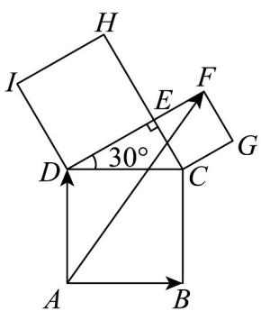
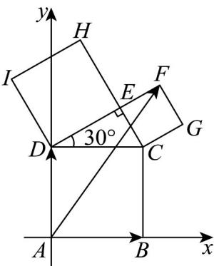

> [!faq]- 《专题04_平面向量基本定理及坐标表示_高效培优期中专项训练_数学人教A》官方解析
>
> > [!success]- **【答案】** A. $AB - AC = BC$ B. 若向量 $a = (2023, 2024)$ ，把 a 向右平移 2 个单位，得到的向量的坐标为 $(2025, 2024)$ C. 在 VABC 中， $AB \cdot AC > 0$ 是 VABC 为锐角三角形的充要条件 D．在VABC中，若 $\lambda$ 为任意实数，且 $\overline{CP}=\lambda\left(\left|\overline{CB}\right|\cdot\overline{CA}+\left|CA\right|\cdot\overline{CB}\right)$ ，则P点的轨迹经过VABC的内心
>
> > [!note]- **【解析】**
> > 对于 A： $AB - AC = CB$ ，故 A 错误；
> >
> > 对于 $^{B}$ ：向量平移后，不改变方向和模长，故平移后与平移前为相等向量，
> > 故把 $a=(2023,2024)$ 向右平移 2 个单位，得到的向量的坐标为 $(2023,2024)$ ，故 $^{B}$ 错误；
> > 对于 $^{C}$ ：由 $AB\cdot AC>0$ ，即 $AB\cdot AC=\left|AB\right|\cdot\left|AC\right|\cos\angle CAB>0$ ，即 $\cos\angle CAB>0$ ，
> > 又 $0<\angle CAB<\pi$ ，所以 $\angle CAB$ 为锐角，不能得到 VABC 为锐角三角形，故充分性不成立
> > 故 $^{C}$ 错误；
> > 对于 $^{D}$ ：由 $\overrightarrow{CP}=\lambda\left(\left|\overrightarrow{CB}\right|\cdot\overrightarrow{CA}+\left|\overrightarrow{CA}\right|\cdot\overrightarrow{CB}\right)$ ，可得 $\overrightarrow{CP}=\left|\overrightarrow{CA}\right|\left|\overrightarrow{CB}\right|\lambda\cdot\left(\frac{\overrightarrow{CA}}{\left|\overrightarrow{CA}\right|}+\frac{\overrightarrow{CB}}{\left|\overrightarrow{CB}\right|}\right)$ 又 $\frac{\overrightarrow{CA}}{\left|CA\right|}$ 表示方向上的单位向量， $\frac{\overrightarrow{CB}}{\left|CB\right|}$ 表示方向上的单位向量，
> > 根据向量加法的几何意义知，以 $\frac{\overrightarrow{CA}}{\left|CA\right|}$ 和 $\frac{\overrightarrow{CB}}{\left|CB\right|}$ 为邻边的平行四边形为菱形，
> > 点 P 在该菱形的对角线上，又菱形的对角线平分一组对角，
> > 故 P 点在 $\angle ACB$ 的平分线上，所以 P 点的轨迹经过 VABC 的内心，故 D 正确。
> > 故选： $^{D}$
> >
> > 22．根据毕达哥拉斯定理，以直角三角形的三条边为边长作正方形，从斜边上作出的正方形的面积正好等于在两直角边上作出的正方形面积之和，现在对直角三角形 CDE 按上述操作作图后，得如图所示的图形，若 $AF = xAB + yAD$ ，则 x - y = （）
> >
> > 【答案】
> >
> > 
> >
> > A. $-\frac{1}{3}$ B. $-\frac{1}{2}$ C. $1 - \sqrt{3}$ D. $\sqrt{3} - 1$
> >
> > 【答案】B
> >
> > 【详解】建立如图所示平面直角坐标系：
> >
> > 
> >
> > 设 $DC = 2a(a > 0)$ ，则 $EC = a, DE = \sqrt{3} a$
> >
> > 则 $A(0,0), B(2a,0), D(0,2a)$ ， $DF = (\sqrt{3} + 1)a$
> >
> > 所以 $x_{F} = \left(\sqrt{3} +1\right)a\cdot \cos 30^{\circ},y_{F} = 2a + \left(\sqrt{3} +1\right)a\cdot \sin 30^{\circ}$ ，即 $F\left(\frac{3 + \sqrt{3}}{2} a,\frac{5 + \sqrt{3}}{2} a\right)$
> >
> > 所以 $\overrightarrow{AF} = \left(\frac{3 + \sqrt{3}}{2} a, \frac{5 + \sqrt{3}}{2} a\right), \overrightarrow{AB} = (2a, 0), \overrightarrow{AD} = (0, 2a)$
> >
> > 因为 $AF = xAB + yAD$
> >
> > 所以 $\left(\frac{3 + \sqrt{3}}{2} a, \frac{5 + \sqrt{3}}{2} a\right) = x(2a, 0) + y(0, 2a)$ ，则 $\left\{ \begin{array}{l} \frac{3 + \sqrt{3}}{2} a = 2ax \\ \frac{5 + \sqrt{3}}{2} a = 2ay \end{array} \right.$ ，
> >
> > 则 $2ax - 2ay = \frac{3 + \sqrt{3}}{2} a - \frac{5 + \sqrt{3}}{2} a = -a$ ，化简得 $x - y = -\frac{1}{2}$
> >
> > 故选 **B**.
