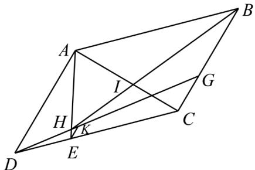

> [!faq]- 《专题04_平面向量基本定理及坐标表示_高效培优期中专项训练_数学人教A》官方解析
>
> > [!success]- **【答案】** (1) $\left(\frac{3}{10},\frac{3}{5}\right)$ (2) $\left(\frac{9}{16},0\right)$
>
> > [!note]- **【解析】**
> > （1）作 $EK \parallel CG$ 交 $DG$ 于 $K$ ，又 $AD \parallel CG$ ，则 $EK \parallel AD$
> >
> > 
> >
> > $$
> > \therefore \frac {E K}{C G} = \frac {D E}{D C} = \frac {1}{3}, E K = \frac {1}{3} C G = \frac {1}{9} B C = \frac {1}{9} A D
> > $$
> >
> > $$
> > \therefore \frac {A H}{H E} = \frac {A D}{E K} = 9, A H = \frac {9}{1 0} A E,
> > $$
> >
> > $$
> > \therefore A E = A D + D E = A D + \frac {1}{2} E C = A D + \frac {1}{2} (A C - A E)
> > $$
> >
> > $$
> > \therefore A E = \frac {1}{3} A C + \frac {2}{3} A D
> > $$
> >
> > $$
> > A H = \frac {9}{1 0} A E = \frac {9}{1 0} \left(\frac {1}{3} A C + \frac {2}{3} A D\right) = \frac {3}{1 0} A C + \frac {3}{5} A D
> > $$
> >
> > ∴ $\frac{A}{AH}$ 坐标为 $\left(\frac{3}{10},\frac{3}{5}\right)$ .
> >
> > (2) $\because AI = AH + HI = AH + \frac{3}{5} IB = AH + \frac{3}{5}\left(AB - AI\right)$
> >
> > $$
> > \therefore \stackrel {\square \square} {A I} = \frac {5}{8} \stackrel {\square \square \square} {A H} + \frac {3}{8} \stackrel {\square \square \square} {A B} = \frac {5}{8} \left(\frac {3}{1 0} \stackrel {\square \square \square} {A C} + \frac {3}{5} \stackrel {\square \square \square} {A D}\right) + \frac {3}{8} \left(\stackrel {\square \square \square} {A C} - \stackrel {\square \square \square} {A D}\right) = \frac {9}{1 6} \stackrel {\square \square \square} {A C}
> > $$
> >
> > $\therefore_{AI}^{uu}$ 坐标为 $\left(\frac{9}{16},0\right)$ .
