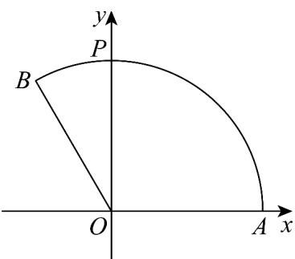

> [!faq]- 《专题04_平面向量基本定理及坐标表示_高效培优期中专项训练_数学人教A》官方解析
>
> > [!success]- **【答案】** B
>
> > [!note]- **【解析】**
> > 
> >
> > 如图， $A(1,0),P(0,1)$ ，又扇形的半径为 $1,\angle AOB = \frac{2\pi}{3}$ ，所以 $B\left(\cos \frac{2\pi}{3},\sin \frac{2\pi}{3}\right)$
> >
> > 即 $B\left(-\frac{1}{2}, \frac{\sqrt{3}}{2}\right)$
> >
> > 所以 $OA = (1,0)$ , $OP = (0,1)$ , $OB = \left(-\frac{1}{2}, \frac{\sqrt{3}}{2}\right)$ ,
> >
> > 由 $\overline{OP} = a\overline{OA} + b\overline{OB}$ ，得 $(0,1) = \left(a - \frac{1}{2} b,\frac{\sqrt{3}}{2} b\right)\Rightarrow \left\{ \begin{array}{l}a - \frac{1}{2} b = 0\\ \frac{\sqrt{3}}{2} b = 1 \end{array} \right.\Rightarrow \left\{ \begin{array}{l}a = \frac{\sqrt{3}}{3}\\ b = \frac{2\sqrt{3}}{3} \end{array} \right.,$
> >
> > 所以 $a + b = \frac{\sqrt{3}}{3} +\frac{2\sqrt{3}}{3} = \sqrt{3}$
> >
> > 故选 **B**
