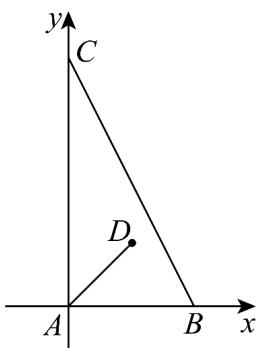

> [!faq]- 《专题04_平面向量基本定理及坐标表示_高效培优期中专项训练_数学人教A》官方解析
>
> > [!success]- **【答案】** B
>
> > [!note]- **【解析】**
> > 如图，以 A 为原点，AB 所在直线为 x 轴，AC 所在直线为 y 轴建立平面直角坐标系则 B 点的坐标为 $(1, 0)$ ，C 点的坐标为 $(0, 2)$
> >
> > 
> >
> > $\because \angle DAB = 45^{\circ}$ ，所以设 D 点的坐标为 $(m, m)(m \neq 0)$
> >
> > $\overline{AD}=(m,m)=\lambda\overline{AB}+\mu\overline{AC}=\lambda(1,0)+\mu(0,2)=(\lambda,2\mu)$ 则 $\lambda=m$ ，且 $\mu=\frac{1}{2}m$ $\therefore \frac{\lambda}{\mu}=2$ ，即 $\lambda-2\mu=0$
> >
> > 故选 **B**
