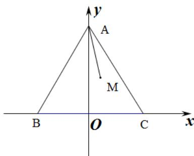

> [!faq]- 《专题04_平面向量基本定理及坐标表示_高效培优期中专项训练_数学人教A》官方解析
>
> > [!success]- **【答案】** $-\frac{1}{4} / -0.25$
>
> > [!note]- **【解析】**
> > 
> >
> > 如图所示，取 BC 的中点 O，以 O 为坐标原点，OC,OA 所在的直线分别为 x 轴，y 轴，建立平面直角坐标系 xOy，VABC 的边长为 $^{2}$ ，则 $A(0,\sqrt{3})$ ， $B(-1,0)$ ， $C(1,0)$ ，
> >
> > 设 $M(x,y)$ ，则 $\overline{AM} = (x,y - \sqrt{3})$ ， $\overline{AB} = (-1, - \sqrt{3}),\overline{AC} = (1, - \sqrt{3})$
> >
> > 因为 $\overline{AM} = \lambda \overline{AB} + \mu \overline{AC}$ ，且 $\lambda + \mu = \frac{1}{2}$ ，
> >
> > 所以 $(x,y-\sqrt{3})=\lambda(-1,-\sqrt{3})+\mu(1,-\sqrt{3})$ ，且 $\lambda+\mu=\frac{1}{2}$ ，
> >
> > 即 $\left\{ \begin{array}{l} x = -\lambda + \mu \\ y - \sqrt{3} = -\sqrt{3} (\lambda + \mu) \\ \lambda + \mu = \frac{1}{2} \end{array} \right.$ ，可得 $\left\{ \begin{array}{l} x = \frac{1}{2} - 2\lambda \\ y = \frac{\sqrt{3}}{2} \end{array} \right.$ .
> >
> > 因为，点 $M$ 在 $\mathrm{VABC}$ 内部，所以 $\left\{ \begin{array}{l} \lambda > 0 \\ \mu > 0 \end{array} \right.$ ，
> >
> > 可得 $0 < \lambda < \frac{1}{2}$ ，所以 $-\frac{1}{2} < x < \frac{1}{2}$ .
> >
> > 所以 $\overrightarrow{MB} = \left(-1 - x, -\frac{\sqrt{3}}{2}\right),\overrightarrow{MC} = \left(1 - x, - \frac{\sqrt{3}}{2}\right)$
> >
> > 所以 $MB \cdot MC = x^{2} - 1 + \frac{3}{4} = x^{2} - \frac{1}{4}$
> >
> > 所以当 x=0 时， $MB \cdot MC$ 取最小值 $-\frac{1}{4}$
> >
> > 故答案为： $-\frac{1}{4}$
