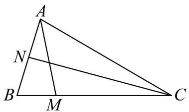

<!-- question-source:start -->
1. 已知在 $V_{ABC}$ 中， $N$ 为 $AB$ 中点， $\overline{BM} = \frac{1}{3} \overline{MC}$ ， $\left|AB\right| = 2$ ， $\left|\overline{AC}\right| = 4$ 。

(1)若 $\angle BAC = 60^{\circ}$ ，求 $\left|\overline{A} M\right|$

(2)设 $_{AB}$ 和 $_{AC}$ 的夹角为 $\theta$ ，若 $\cos\theta=\frac{1}{4}$ ，求证： $CN\perp AB$ ；

(3)若线段 $NC$ 上一动点 $P$ 满足 $\overline{AP} = \frac{1}{2}\overline{AC} +\frac{1}{4}\overline{AB}$ ，试确定点 $P$ 的位置
<!-- question-source:end -->

![[高中/课堂同步/题库/人教A版高中数学同步讲义(2026)/02_必修第二册/期中专项训练+期中模拟卷/专项训练/专题06_平面向量的应用_高效培优期中专项训练_数学人教A版高一必修第/_compact/answers/Q00063883A1.md]]
