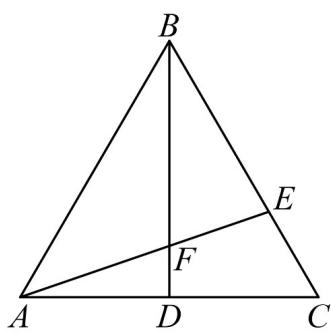

<!-- question-source:start -->
6. 如图，在等边三角形 $ABC$ 中， $AB = 2, \overline{AD} = \overline{DC}, \overline{BE} = 2\overline{EC}$ ，线段 $AE$ 与 $BD$ 交于点 $F$ .

(1)求 $AE \cdot BD$ ;

(2)求 $\cos \angle AFB$

(3)若 $M$ 为VABC所在平面内一动点，求 $\overline{MA} \cdot \overline{MB} + 2\overline{MA} \cdot \overline{MC}$ 的最小值·
<!-- question-source:end -->

![[高中/课堂同步/题库/人教A版高中数学同步讲义(2026)/02_必修第二册/期中专项训练+期中模拟卷/专项训练/专题06_平面向量的应用_高效培优期中专项训练_数学人教A版高一必修第/_compact/answers/Q00063888A1.md]]
