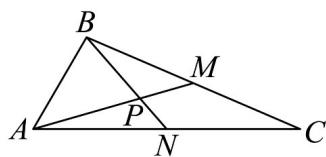

<!-- question-source:start -->
7. 如图，在 $\mathrm{VABC}$ 中，已知 $AB = 2$ ， $AC = 5$ ， $\angle BAC = 60^{\circ}$ ， $BC$ ， $AC$ 边上的两条中线 $AM$ ， $BN$ 相交于

点P，

(1)求 $\left|PN\right|$ ;

(2)求 $\angle MPN$ 的正弦值·
<!-- question-source:end -->

![[高中/课堂同步/题库/人教A版高中数学同步讲义(2026)/02_必修第二册/期中专项训练+期中模拟卷/专项训练/专题06_平面向量的应用_高效培优期中专项训练_数学人教A版高一必修第/_compact/answers/Q00063889A1.md]]
