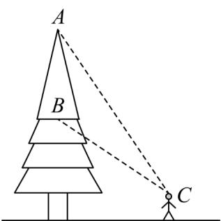

<!-- question-source:start -->
10. 如图：已知树顶 $A$ 离地面 $\frac{21}{2}$ 米，树上另一点 $B$ 离地面 $\frac{11}{2}$ 米，某人在离地面 $\frac{3}{2}$ 米的 $C$ 处看此树，则该人离此树（）米时，看 $A$ 、 $B$ 的视角最大。

A. 4 B. 5 C. 6 D. 7
<!-- question-source:end -->

![[高中/课堂同步/题库/人教A版高中数学同步讲义(2026)/02_必修第二册/期中专项训练+期中模拟卷/专项训练/专题06_平面向量的应用_高效培优期中专项训练_数学人教A版高一必修第/_compact/answers/Q00063892A1.md]]
