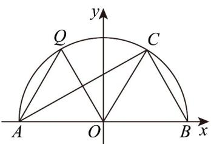

> [!faq]- 《专题06_平面向量的应用_高效培优期中专项训练_数学人教A版高一必修第》官方解析
>
> > [!success]- **【答案】** $^{(1)}$ 证明见解析 (2) $\frac{1}{2}$
>
> > [!note]- **【解析】**
> > （1）如图，建立平面直角坐标系·
> >
> > 
> >
> > （方法一）由题意可知 $\left|OB\right|=1$ ，设 $\angle COB=\alpha$ ，则 $\alpha\in(0,\pi)$
> >
> > $A(-1,0)$ ， $B(1,0)$ ， $C(\cos \alpha ,\sin \alpha)$ ，得 $AC = (\cos \alpha +1,\sin \alpha)$ ， $BC = (\cos \alpha -1,\sin \alpha)$
> >
> > 所以 $AC \cdot BC = \cos^{2}\alpha - 1 + \sin^{2}\alpha = 1 - 1 = 0$ ，故 $AC \perp BC$ ，即 $AC \perp BC \cdot$
> >
> > （方法二）由题意可知 $|OB|=1$ ， $A(-1,0)$ ， $B(1,0)$ ，设 $C(a,b)$
> >
> > 则 $\left|OB\right|=\left|OC\right|=\sqrt{a^{2}+b^{2}}=1$ ，得 $a^{2}+b^{2}=1$ ，得 $\overline{A C}=(a+1,b)$ ， $\overline{B C}=(a-1,b)$ ，
> >
> > 所以 $AC \cdot BC = a^{2} - 1 + b^{2} = 1 - 1 = 0$ ，故 $AC \perp BC$ ，即 $AC \perp BC$ 。
> >
> > (2) 由题意得 $\angle COB = \frac{\pi}{3}$ ，则 $C\left(\frac{1}{2}, \frac{\sqrt{3}}{2}\right)$ ，设 $\angle QOB = \beta$ ，则 $\beta \in \left(\frac{\pi}{3}, \pi\right)$ ， $Q(\cos \beta, \sin \beta)$ ，
> >
> > 由（1）得 $\overrightarrow{CB} = \overrightarrow{OB} -\overrightarrow{OC} = \left(\frac{1}{2}, - \frac{\sqrt{3}}{2}\right)$ ， $QA = (-1 - \cos \beta , - \sin \beta)$
> >
> > 所以 $QA \cdot CB = -\frac{1}{2} - \frac{1}{2} \cos \beta + \frac{\sqrt{3}}{2} \sin \beta = \sin \left( \beta - \frac{\pi}{6} \right) - \frac{1}{2}$
> >
> > 由 $\beta\in\left(\frac{\pi}{3},\pi\right)$ ，得 $\beta-\frac{\pi}{6}\in\left(\frac{\pi}{6},\frac{5\pi}{6}\right)$ ，当 $\beta-\frac{\pi}{6}=\frac{\pi}{2}$ ，即 $\beta=\frac{2\pi}{3}$ 时， $\left(QA\cdot CB\right)_{\max}=\frac{1}{2}$ .
> >
> > 故 $QA \cdot CB$ 的最大值为 $\frac{1}{2}$
