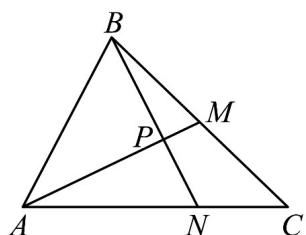

> [!faq]- 《专题06_平面向量的应用_高效培优期中专项训练_数学人教A版高一必修第》官方解析
>
> > [!success]- **【答案】** 
>
> > [!note]- **【解析】**
> > 因为 $M$ 是 $BC$ 的中点，所以 $\overline{AM} = \frac{1}{2}\overline{AB} +\frac{1}{2}\overline{AC}$
> >
> > $$
> > | \overrightarrow {A M} | = \sqrt {\left(\frac {1}{2} \overrightarrow {A B} + \frac {1}{2} \overrightarrow {A C}\right) ^ {2}} = \sqrt {\frac {1}{4} | \overrightarrow {A B} | ^ {2} + \frac {1}{4} | \overrightarrow {A C} | ^ {2} + \frac {1}{2} | \overrightarrow {A B} | | \overrightarrow {A C} | \cdot \cos 6 0 ^ {\circ}}
> > $$
> >
> > $$
> > = \sqrt {1 + \frac {9}{4} + \frac {1}{2} \times 2 \times 3 \times \frac {1}{2}} = \frac {\sqrt {1 9}}{2}
> > $$
> >
> > 因为 $\square AN = \frac{2}{3} AC$ ， $\square BN = \square AN - AB = \frac{2}{3} AC - AB$
> >
> > $$
> > | \overrightarrow {B N} | = \sqrt {\left(\frac {2}{3} \overrightarrow {A C} - \overrightarrow {A B}\right) ^ {2}} = \sqrt {\frac {4}{9} | \overrightarrow {A C} | ^ {2} + | \overrightarrow {A B} | ^ {2} - \frac {4}{3} | \overrightarrow {A C} | | \overrightarrow {A B} | \times \frac {1}{2}}
> > $$
> >
> > $$
> > = \sqrt {\frac {4}{9} \times 9 + 4 - \frac {4}{3} \times 3 \times 2 \times \frac {1}{2}} = 2
> > $$
> >
> > 所以 $\frac{A}{AM} \cdot \frac{B}{BN} = \left( \frac{1}{2} AB + \frac{1}{2} AC \right) \cdot \left( \frac{2}{3} AC - AB \right) = -\frac{1}{2} |AB|^{2} + \frac{1}{3} |AC|^{2} - \frac{1}{6} |AB||AC| \times \frac{1}{2}$
> >
> > $$
> > = - \frac {1}{2} \times 4 + \frac {1}{3} \times 9 - \frac {1}{6} \times 2 \times 3 \times \frac {1}{2} = \frac {1}{2}
> > $$
> >
> > $$
> > \cos \angle M P N = \cos <   \overline {{A M}}, \overline {{B N}} > = \frac {\overline {{A M}} \cdot \overline {{B N}}}{| A M | \cdot B N |} = \frac {\frac {1}{2}}{\frac {\sqrt {1 9}}{2} \times 2} = \frac {\sqrt {1 9}}{3 8}.
> > $$
> >
> > 故答案为： $\frac{\sqrt{19}}{38}$
