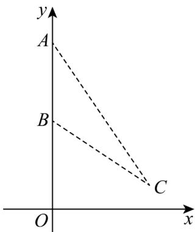

> [!faq]- 《专题06_平面向量的应用_高效培优期中专项训练_数学人教A版高一必修第》官方解析
>
> > [!success]- **【答案】** C
>
> > [!note]- **【解析】**
> > 如图建立平面直角坐标系，则 $A(0, \frac{21}{2}), B(0, \frac{11}{2})$ ，设 $C(x, \frac{3}{2})(x > 0)$
> >
> > 
> >
> > 则 $CA = (-x, 9), CB = (-x, 4)$
> >
> > $$
> > \cos \angle A C B = \frac {\square C A \cdot \square C B}{| C A | \cdot | C B |} = \frac {x ^ {2} + 3 6}{\sqrt {x ^ {2} + 1 6} \cdot \sqrt {x ^ {2} + 8 1}}
> > $$
> >
> > $$
> > = \frac {1}{\sqrt {\frac {(x ^ {2} + 1 6) (x ^ {2} + 8 1)}{(x ^ {2} + 3 6) ^ {2}}}} = \frac {1}{\sqrt {1 + \frac {2 5}{x ^ {2} + 3 6} - \frac {9 0 0}{(x ^ {2} + 3 6) ^ {2}}}} \quad \frac {1 2}{1 3}
> > $$
> >
> > 又 $0 < \angle ACB < \pi$ ，且余弦函数在 $(0, \pi)$ 单调递减，
> >
> > 则当 $\frac{1}{x^2 + 36} = \frac{1}{72}$ ，即 $x = 6$ 时 $\angle ACB$ 最大·
> >
> > 即该人离此树 $^{6}$ 米时，看 A、B 的视角最大·
> >
> > 故选：C
> >
> > 考点03用向量解决线段的长度问题
