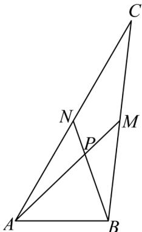

> [!faq]- 《专题06_平面向量的应用_高效培优期中专项训练_数学人教A版高一必修第》官方解析
>
> > [!success]- **【答案】** BD
>
> > [!note]- **【解析】**
> > 如图所示：由题可知，M,N 分别为 BC,AC 中点，则 $AM = \frac{1}{2} \left( AB + AC \right)$
> >
> > 同时平方得 $AM^2 = \frac{1}{4}\left(AB^2 + AC^2 + 2AB \cdot AC\right)$
> >
> > $$
> > = \frac {1}{4} \left(\left| A B \right| ^ {2} + \left| A C \right| ^ {2} + 2 \left| A B \right| \cdot \left| A C \right| \cdot \cos \angle B A C\right) = \frac {1}{4} \left(4 + 2 5 + 2 \cdot 2 \cdot 5 \cdot \frac {1}{2}\right) = \frac {3 9}{4},
> > $$
> >
> > 则 $\left|AM\right|=\frac{\sqrt{39}}{2}$ ，故A错误；
> >
> > 又 $BN = AN - AB$
> >
> > 同时平方得 $\overline{BN}^{2}=\left(\overline{AN}-\overline{AB}\right)^{2}=\overline{AN}^{2}+\overline{AB}^{2}-2\overline{AN}\cdot\overline{AB}=\frac{25}{4}+4-2\times\frac{5}{2}\times2\times\frac{1}{2}=\frac{21}{4}$
> >
> > 则 $\left|\overrightarrow{BN}\right|=\frac{\sqrt{21}}{2}$ ，故B正确；
> >
> > $$
> > \cos \angle M P N = \frac {\underset {P M} {\square \square \square} \cdot \underset {P N} {\square \square \square}}{\left| P M \right| \cdot \left| P N \right|} = \frac {\frac {1}{3} A M \cdot \frac {1}{3} B N}{\frac {1}{3} \left| A M \right| \cdot \frac {1}{3} \left| B N \right|} = \frac {\frac {1}{2} \left(A B + A C\right) \cdot \left(\frac {1}{2} A C - A B\right)}{\left| A M \right| \cdot \left| B N \right|}
> > $$
> >
> > $= \frac{1}{2}\cdot \frac{-AB^{2} + \frac{1}{2}AC^{2} - \frac{1}{2}AB\cdot AC}{|AM|\cdot|BN|} = \frac{1}{2}\cdot \frac{-4 + \frac{25}{2} - \frac{1}{2}\times 2\times 5\times\frac{1}{2}}{\frac{\sqrt{39}}{2}\times\frac{\sqrt{21}}{2}} = \frac{4\sqrt{91}}{91}$ ，故C错误；
> >
> > $$
> > P A + P B + P C = - A P + \left( \begin{array}{c c} U U & U U \\ A B - A P \end{array} \right) + \left( \begin{array}{c c} U U & U U \\ A C - A P \end{array} \right) = A B + A C - 3 A P
> > $$
> >
> > $= AB + AC - 3 \times \frac{2}{3} AM = AB + AC - 3 \times \frac{2}{3} \times \frac{1}{2} \left( AB + AC \right) = 0$ ，故 D 正确.
> >
> > 
> >
> > 故选 **BD**
