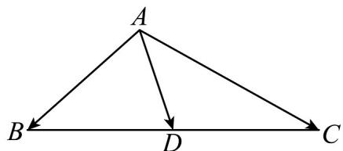

> [!faq]- 《专题06_平面向量的应用_高效培优期中专项训练_数学人教A版高一必修第》官方解析
>
> > [!success]- **【答案】** A
>
> > [!note]- **【解析】**
> > 如图所示，由题意可得：
> >
> > $$
> > \stackrel {\square \square \square} {A D} = \frac {1}{2} \left(\stackrel {\square \square \square} {A B} + \stackrel {\square \square \square} {A C}\right) \Rightarrow \stackrel {\square \square \square} {A D} ^ {2} = \frac {1}{4} \left(\stackrel {\square \square \square} {A B} ^ {2} + \stackrel {\square \square \square} {A C} ^ {2} + 2 A B \cdot \stackrel {\square \square \square} {A C}\right) = \frac {1 9}{4},
> > $$
> >
> > 即 $\frac{9}{4} +\frac{1}{4} AC^2 -\frac{3}{4} AC = \frac{19}{4}$ ，解之得 $AC = 5$
> >
> > 故选：A
> >
> > 
