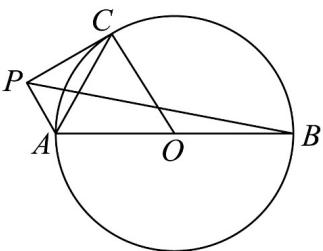
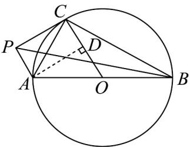

> [!faq]- 《专题06_平面向量的应用_高效培优期中专项训练_数学人教A版高一必修第》官方解析
>
> > [!success]- **【答案】**  A. 9 B. 16 C. 25 D. 36
>
> > [!note]- **【解析】**
> > 
> >
> > 如图所示，易知 $AC \perp BC$ ， $AP \perp PC$ ， $OC \perp PC$
> >
> > 过点 A 作 $AD \perp OC$ 于点 D，则四边形 ADCP 为矩形，
> >
> > $$
> > \stackrel {{\text {UUU}}} {{A C}} \cdot \stackrel {{\text {UUU}}} {{P B}} = \stackrel {{\text {UUU}}} {{A C}} \cdot \left(\stackrel {{\text {UUU}}} {{P A}} + \stackrel {{\text {UUU}}} {{A B}}\right) = \left(\stackrel {{\text {UUU}}} {{A P}} + \stackrel {{\text {UUU}}} {{P C}}\right) \cdot \stackrel {{\text {UUU}}} {{P A}} + \stackrel {{\text {UUU}}} {{A C}} \cdot \left(\stackrel {{\text {UUU}}} {{A C}} + \stackrel {{\text {UUU}}} {{C B}}\right) = - \left| \stackrel {{\text {UUU}}} {{A P}} \right| ^ {2} + \left| \stackrel {{\text {UUU}}} {{A C}} \right| ^ {2} = \left| \stackrel {{\text {UUU}}} {{P C}} \right| ^ {2} = \left| \stackrel {{\text {UUU}}} {{A D}} \right| ^ {2} = \left| \stackrel {{\text {UUU}}} {{A O}} \right| ^ {2} - \left| \stackrel {{\text {UUU}}} {{O D}} \right| ^ {2}
> > $$
> >
> > 又 $\left|OD\right|\in[0,5]$ ， $\left|AO\right|=5$
> >
> > 所以 $AC \cdot PB = |AO|^2 - |OD|^2 \in [0, 25]$
> >
> > 即 $AC \cdot PB$ 的最大值为 25
> >
> > 故选：C.
> >
> > 考点 05 向量在物理中的应用
