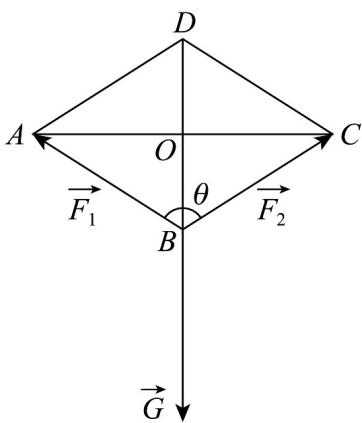
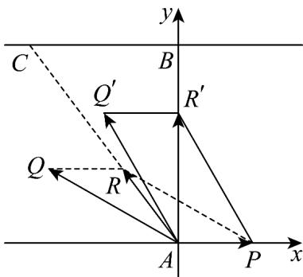

> [!faq]- 《专题06_平面向量的应用_高效培优期中专项训练_数学人教A版高一必修第》官方解析
>
> > [!success]- **【答案】** AC
>
> > [!note]- **【解析】**
> > 
> >
> > 因为 $\left|\stackrel{\cup}{F}_{1}\right|=\left|\stackrel{\cup}{F}_{2}\right|$ ，所以平行四边形法则为菱形，故 $\left|\stackrel{\square}{F}_{1}\right|\cos\frac{\theta}{2}=\frac{1}{2}\left|G\right|$ ，即 $\left|\stackrel{\leftrightarrow}{F}_{1}\right|=\frac{\left|G\right|}{2\cos\frac{\theta}{2}}$ ，故 A 正确；
> >
> > 根据向量加法的平行四边形法则 $\theta$ 越小越省力， $\theta$ 越大越费力，故 B 错误；
> >
> > 当 $\theta=\frac{2\pi}{3}$ 时， $\angle ABD=\frac{\pi}{3}$ ，又 AB=AD，所以 $\triangle ABD$ 为等边三角形，即 $\left|\stackrel{\cup}{F}_{1}\right|=\left|G\right|$ ，故 C 正确；
> >
> > 若 $\theta=\pi$ ，则 $\stackrel{\cup}{F}_{1}+\stackrel{\cup}{F}_{2}=0$ ，与 $\stackrel{\cup}{F}_{1}+\stackrel{\cup}{F}_{2}=G$ 矛盾，所以 $\theta\neq\pi$ ，故 D 错误；
> >
> > 故选：AC.
> >
> > 22. 一条东西方向的河流两岸平行，河宽 $800\mathrm{m}$ ，水流的速度为向东 $4km / \mathrm{h}$ 。河南岸有一码头 $A$ ，码头 $A$ 正对面有一货站 $B$ （ $AB$ 与河的方向垂直）， $B$ 的正西方向且与 $B$ 相距 $600\mathrm{m}$ 另有货站 $C$ ，已知一货船匀速航行，当货船自码头 $A$ 航行到货站 $C$ 航程最短时，合速度为 $5km / \mathrm{h}$ 。
> >
> > (1)求货船航行速度的大小；
> >
> > (2)若货船从 A 出发垂直到达正对岸的货站 B 处，求货船到达 B 处所需时间·
> >
> > 【答案】(1) $\sqrt{65} \mathrm{~km} / \mathrm{h}$
> >
> > (2) $\frac{4}{35}$ h
> >
> > 【详解】（1）以 A 为坐标原点，以东向方向为 x 轴，以垂直对岸的方向为 y 轴建立直角坐标系如图所示。货船从码头 A 航行到货站 C 的最短路径要求合速度方向由 A 指向 C。
> >
> > 设货船在静水中的速度为 $\overline{AQ} = (x, y)$ ，水流速度为 4 km/h 向东，即 $\overline{AP} = (4, 0)$ ,
> >
> > 合速度为水流速度与船速的矢量和： $AR = AP + AQ = (x + 4, y)$
> >
> > 由题意，合速度方向与向量 $AC = (-0.6, 0.8)$ 同向，且大小为 5km/h·
> >
> > 设合速度为 $AR = k(-0.6, 0.8)$ ，则： $\sqrt{(-0.6k)^{2} + (0.8k)^{2}} = 5$ 和 k = 5。
> >
> > 因此，合速度为 $AR = (-3, 4)$
> >
> > 联立方程： $\left\{\begin{aligned}x+4&=-3\\ y&=4\end{aligned}\right.$ $\Rightarrow x=-7,y=4.$
> >
> > 货船速度大小为： $\left|AQ\right|=\sqrt{(-7)^{2}+4^{2}}=\sqrt{65}km/h.$
> >
> > 
> >
> > (2) 货船要垂直到达正对岸 B，需使合速度的东向分量为 0.
> >
> > 设船速为 $AQ' = (x, y)$ ，则： $x + 4 = 0$ ， $x = -4$ 。
> >
> > 由（1）知船速大小为 $\left|\overline{A}Q^{\prime}\right|=\left|\overline{A}Q\right|=\sqrt{65}$ ，故： $(-4)^{2}+v_{y}^{2}=65\overrightarrow{v}_{y}=7.$
> >
> > 合速度的北向分量为 $7km / \mathrm{h}$ ，河宽 $0.8km$ ，所需时间为： $t = \frac{0.8}{7} = \frac{4}{35}$ 小时
