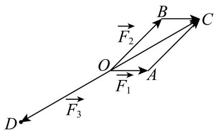
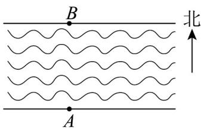
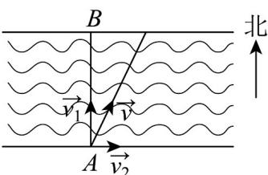
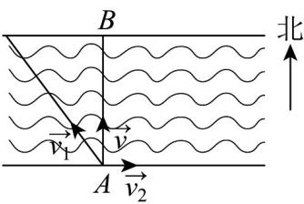

> [!faq]- 《专题06_平面向量的应用_高效培优期中专项训练_数学人教A版高一必修第》官方解析
>
> > [!success]- **【答案】** $\frac{5\pi}{6}$
>
> > [!note]- **【解析】**
> > 作 $OA = F_1$ ， $OB = F_2$ ， $OD = F_3$ ，以 $OA$ 、 $OB$ 为邻边作平行四边形 $OACB$ ，
> >
> > 则 $OC = OA + OB = F_{1} + F_{2} = -F_{3}$
> >
> > 
> >
> > 由题意可得 $\left|OA\right|=1$ ， $\left|OB\right|=\frac{\sqrt{6}+\sqrt{2}}{2}$ ， $\angle AOB=\frac{\pi}{4}$ ，
> >
> > $\overrightarrow{OA} \cdot \overrightarrow{OB} = \left| \overrightarrow{OA} \right| \cdot \left| \overrightarrow{OB} \right| \cos \frac{\pi}{4} = 1 \times \frac{\sqrt{6} + \sqrt{2}}{2} \times \frac{\sqrt{2}}{2} = \frac{\sqrt{3} + 1}{2}$
> >
> > $$
> > \left| \overline {{O C}} \right| = \sqrt {\left(\overline {{O A}} + \overline {{O B}}\right) ^ {2}} = \sqrt {\overline {{O A}} ^ {2} + 2 O A \cdot \overline {{O B}} + \overline {{O B}} ^ {2}} = \sqrt {1 + (\sqrt {3} + 1) + (\sqrt {3} + 2)} = \sqrt {4 + 2 \sqrt {3}} = \sqrt {3} + 1
> > $$
> >
> > $\overrightarrow{OA} \cdot \overrightarrow{OC} = \overrightarrow{OA} \cdot (\overrightarrow{OA} + \overrightarrow{OB}) = \overrightarrow{OA}^{2} + \overrightarrow{OA} \cdot \overrightarrow{OB} = 1 + \frac{\sqrt{3} + 1}{2} = \frac{3 + \sqrt{3}}{2}$
> >
> > 所以， $\cos \angle AOC = \frac{\square\square\square\square\square\square}{\square\square\square\square\square}\cdot\frac{\square\square\square\square}{\square\square\square\square}$ $= \frac{\frac{3 + \sqrt{3}}{2}}{1\times(\sqrt{3} + 1)} = \frac{\sqrt{3}}{2}$
> >
> > 因为 $0 \leq \angle AOC \leq \pi$ ，故 $\angle AOC = \frac{\pi}{6}$ ，则 $\angle AOD = \frac{5\pi}{6}$ ，
> >
> > 因此， $F_{3}$ 与 $F_{1}$ 夹角的大小为 $\frac{5\pi}{6}$
> >
> > 故答案为： $\frac{5\pi}{6}$
> >
> > 24. 一艘船从码头 $A$ 出发，计划向正北方向直线航行到对岸的 $B$ 点， $AB$ 距离为 $^{100}$ 公里·船在静水中的航速为 $^{50}$ 公里/小时，但河流以 $^{25}$ 公里/小时的速度持续向东流动·
> >
> > 
> >
> > (1)若船头始终指向正北方向，求船到达对岸时实际停靠点与 $B$ 点的偏离距离；
> >
> > (2)若船需要准确到达正北方向的 B 点，求船头应调整的方向（即船头方向与正北方向的夹角 $\theta$ ），以及到达 B 点所需时间·
> >
> > 【答案】(1)50 公里；
> >
> > (2) $\theta = \frac{\pi}{6}$ , $\frac{4\sqrt{3}}{3}$ 小时.
> >
> > 【详解】（1）设船在静水中的速度为 $v_{1}$ ，水流速度为 $v_{2}$ ，船实际航行速度为 v，则 $\left|\begin{matrix}\bar{v}_{1}&=50,\\ \bar{v}_{2}&=25\end{matrix}\right.$ ，由船头始终指向正北方向，得 $v_{1}\perp v_{2}$ ，而 $v=v_{1}+v_{2}$ ，向量 $v,v_{1}$ 的夹角为 $\left\langle v,v_{1}\right\rangle$ ，
> >
> > 于是 $\tan\left\langle v,v_{1}\right\rangle=\frac{\left|\vec{v}_{2}\right|}{\left|v_{1}\right|}=\frac{25}{50}=\frac{1}{2}$
> >
> > 所以船到达对岸时实际停靠点与 B 点的偏离距离为 $\left|AB\right|\tan\left\langle v,v_{1}\right\rangle=100\times\frac{1}{2}=50$ （公里）.
> >
> > 
> >
> > (2) 由 (1) 知， $\left|\stackrel{\sqcup}{v}_{1}\right|=50,\left|\stackrel{\sqcup}{v}_{2}\right|=25,\quad v=\stackrel{\sqcup}{v}_{1}+\stackrel{\sqcup}{v}_{2},\quad\theta=\left\langle v,\stackrel{\sqcup}{v}_{1}\right\rangle$
> >
> > 由船需要准确到达正北方向的 $B$ 点，得 $\nu \perp \nu_{2}$
> >
> > 则 $v \cdot v_2 = (v_1 + v_2) \cdot v_2 = v_1 \cdot v_2 + v_2 = 50 \times 25 \cos \langle v_1, v_2 \rangle + 25^2 = 0$ ，解得 $\cos \langle v_1, v_2 \rangle = -\frac{1}{2}$
> >
> > 而 $0 \leq \left\langle v_1, v_2 \right\rangle \leq \pi$ ，于是 $\left\langle v_1, v_2 \right\rangle = \frac{2\pi}{3}$ ， $\theta = \left\langle v_1, v_2 \right\rangle - \frac{\pi}{2} = \frac{\pi}{6}$ ，
> >
> > $$
> > | \vec {v} | = \sqrt {\vec {v} _ {1} ^ {2} + \vec {v} _ {2} ^ {2} + 2 \vec {v} _ {1} \cdot \vec {v} _ {2}} = \sqrt {5 0 ^ {2} + 2 5 ^ {2} + 2 \times 5 0 \times 2 5 \times \left(- \frac {1}{2}\right)} = 2 5 \sqrt {3}, \frac {1 0 0}{| v |} = \frac {4 \sqrt {3}}{3},
> > $$
> >
> > 所以船头应调整的方向 $\theta=\frac{\pi}{6}$ ，到达 B 点所需时间为 $\frac{4\sqrt{3}}{3}$ 小时。
> >
> > 
