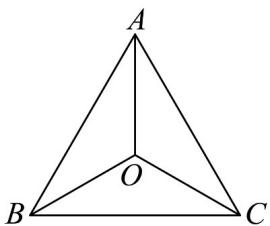
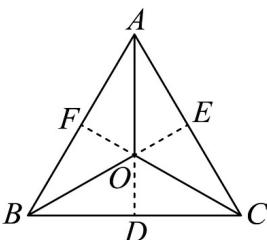

> [!faq]- 《专题06_平面向量的应用_高效培优期中专项训练_数学人教A版高一必修第》官方解析
>
> > [!success]- **【答案】** A. $\theta$ 越小越费力， $\theta$ 越大越省力 B. $\theta$ 的范围为 $[0, \pi]$ C. 当 $\theta = \frac{2\pi}{3}$ 时， $\left|\overline{F_1}\right| = \left|G\right|$ D. 当 $\theta = \frac{\pi}{2}$ 时， $\left|\overline{F_1}\right| = \left|G\right|$
>
> > [!note]- **【解析】**
> > 如图所示，根据题意依次分析选项：
> >
> > 对于 $^{A}$ ，由于 $\stackrel{\cup}{F_{1}} + \stackrel{\cup}{F_{2}} = G$ ，且 $\left|\stackrel{\cup}{F_{1}}\right| = \left|\stackrel{\cup}{F_{2}}\right|$ ，则有 $\left|\stackrel{\square}{F_{1}}\right| \cos \frac{\theta}{2} = \frac{1}{2} \left|G\right|$ ，即 $\left|\stackrel{\cup}{F_{1}}\right| = 2 \cos \frac{\theta}{2}$ .
> >
> > 又 $|G|$ 为定值，故 $\theta$ 越小越省力， $\theta$ 越大越费力， $^{A}$ 错误；
> >
> > 对于 B，当 $\theta = \pi$ 时， $F_{1} + F_{2} = 0$ ，行李包不会处于平衡状态，即 $\theta \neq \pi$ ，B 错误；
> >
> > 对于 C，当 $\theta=\frac{2\pi}{3}$ 时，有 $\left|\stackrel{\square}{F}_{1}\right|\cos\frac{\pi}{3}=\frac{1}{2}\left|\stackrel{\rightarrow}{G}\right|$ ，则 $\left|\stackrel{\square}{F}_{1}\right|=\left|G\right|$ ，C 正确；
> >
> > 对于 D，当 $\theta=\frac{\pi}{2}$ 时，有 $\left|\overrightarrow{F_{1}}\right|\cos\frac{\pi}{4}=\frac{1}{2}\left|\overrightarrow{G}\right|$ ，则 $\sqrt{2}\left|\overrightarrow{F_{1}}\right|=\left|G\right|$ ，D 错误.
> >
> > 故选：C
> >
> > ## 考点06向量在几何中的应用
> >
> > 26. “奔驰定理”是平面向量中一个非常优美的结论，因为这个定理对应的图形与“奔驰”轿车的 logo 很相似。
> >
> > 故形象地称其为“奔驰定理”·其内容为：已知 O 是 VABC 内一点， $\triangle BOC, \triangle AOC, \triangle AOB$ 的面积分别为 $S_{A}, S_{B}, S_{C}$ ，则 $S_{A} \cdot OA + S_{B} \cdot OB + S_{C} \cdot OC = 0$ 。设 O 是锐角 VABC 的垂心·且 $3OA + 4OB + 5OC = 0$ ，则 $\tan \angle AOB =$ \_\_\_\_.
> >
> > 
> >
> > 
> >
> > 【答案】 $-\sqrt{5}$
> >
> > 【详解】如图，延长 AO 交 BC 于点 D，延长 BO 交 AC 于点 E，延长 CO 交 AB 于点 F．故 $AO \perp BC, BO \perp AC, CO \perp AB$ ，
> >
> > $3OA + 4OB + 5OC = 0$ ，由“奔驰定理”得， $S_{A}:S_{B}:S_{C} = 3:4:5$
> >
> > 
> >
> > 则 $S_{A}: S_{\triangle ABC} = 3:12 = 1:4$ ，即 $OD: AD = 1:4$ ，设 $OD = m$ ，则 $OA = 3m$
> >
> > 同理 $S_{B}: S_{\triangle ABC} = 4:12 = 1:3$ ，即 $OE: BE = 1:3$ ，设 $OE = n$ ，则 $OB = 2n$ .
> >
> > 由 $\cos \angle BOD = \cos \angle AOE$ ，得 $\frac{OD}{OB} = \frac{OE}{OA}$ ，即 $\frac{m}{2n} = \frac{n}{3m}$ ，所以 $3m^2 = 2n^2$
> >
> > 所以 $\frac{m}{n} = \frac{\sqrt{2}}{\sqrt{3}}$ ，所以 $\cos \angle BOD = \frac{OD}{OB} = \frac{m}{2n} = \frac{\sqrt{2}}{2\sqrt{3}} = \frac{\sqrt{6}}{6}$
> >
> > 又 $\angle AOB + \angle BOD = \pi$ ，所以 $\cos \angle AOB = -\cos \angle BOD = -\frac{\sqrt{6}}{6}$
> >
> > 所以 $\sin \angle AOB = \sqrt{1 - \left(-\frac{\sqrt{6}}{6}\right)^2} = \frac{\sqrt{30}}{6}$
> >
> > 则 $\tan \angle AOB = \frac{\sin\angle AOB}{\cos\angle AOB} = -\sqrt{5}$
> >
> > 故答案为： $-\sqrt{5}$
