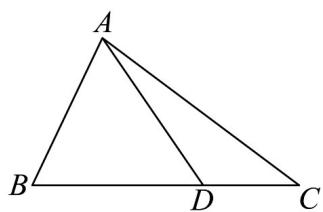

<!-- question-source:start -->
13. 如图，在 $\forall ABC$ 中，点 $D$ 在线段 $BC$ 上，且 $BD = 2DC$ ， $AD = 2$

(1)若 $\triangle ABD$ 是正三角形，求 $AC$ 的长；

(2)若 $\cos B = \frac{3\sqrt{10}}{10}$ ， $\angle ADC = 135^{\circ}$ ，求 $CD$ 的长.
<!-- question-source:end -->

![[高中/课堂同步/题库/人教A版高中数学同步讲义(2026)/02_必修第二册/期中专项训练+期中模拟卷/专项训练/专题07_正弦定理_余弦定理_高效培优期中专项训练_数学人教A版高一必/_compact/answers/Q00063921A1.md]]
