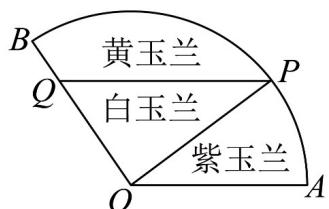

<!-- question-source:start -->
14. 某种植园准备将如图扇形空地 $AOB$ 分成三部分，分别种植白玉兰、黄玉兰和紫玉兰，已知扇形的半径为 $20$ 米，圆心角为 $\angle AOB = \frac{2\pi}{3}$ ，动点 $P$ 在扇形的弧上，点 $Q$ 在 $OB$ 上，且 $PQ // OA$ 。

(1) 当 $OQ = 10$ 米时，求分隔栏 PQ 的长；

(2)若要求白玉兰种植区 $\triangle OPQ$ 的面积尽可能的大，设 $\angle POQ = \theta$ ，求 $\triangle OPQ$ 的面积的最大值并求出此时 $\theta$ 的大小·
<!-- question-source:end -->

![[高中/课堂同步/题库/人教A版高中数学同步讲义(2026)/02_必修第二册/期中专项训练+期中模拟卷/专项训练/专题07_正弦定理_余弦定理_高效培优期中专项训练_数学人教A版高一必/_compact/answers/Q00063922A1.md]]
