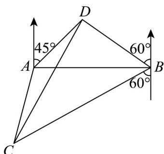

<!-- question-source:start -->
57. 某海域的东西方向上分别有 $A, B$ 两个观测点（如图），它们相距 $10(3 + \sqrt{3})$ 海里·现有一艘轮船在 $D$ 点发出求救信号，经探测得知 $D$ 点位于 $A$ 点北偏东 $45^{\circ}$ ， $B$ 点北偏西 $60^{\circ}$ ，这时，位于 $B$ 点南偏西 $60^{\circ}$ 且与 $B$ 点相距 $40\sqrt{3}$ 海里的 $C$ 点有一救援船，其航行速度为 30 海里/小时·

(1)求 $B$ 点到 $D$ 点的距离 $BD$ ；

(2)若命令 $C$ 处的救援船立即前往 $D$ 点营救，求该救援船到达 $D$ 点需要的时间
<!-- question-source:end -->

![[高中/课堂同步/题库/人教A版高中数学同步讲义(2026)/02_必修第二册/期中专项训练+期中模拟卷/专项训练/专题07_正弦定理_余弦定理_高效培优期中专项训练_数学人教A版高一必/_compact/answers/Q00063956A1.md]]
