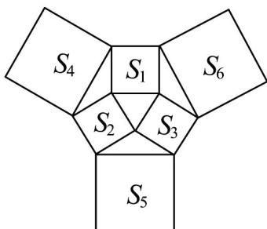
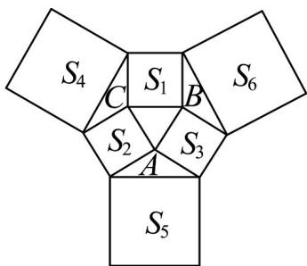

> [!faq]- 《专题07_正弦定理_余弦定理_高效培优期中专项训练_数学人教A版高一必》官方解析
>
> > [!success]- **【答案】** 
>
> > [!note]- **【解析】**
> > 记正方形面积为 $S_{1}, S_{2}, S_{3}, S_{4}, S_{5}, S_{6}$ 的边长分别为 $a, b, c, d, e, f$
> >
> > 三角形 ABC 对应的三边分别为 a, b, c,
> >
> > 由余弦定理可得， $d^2 = a^2 +b^2 -2ab\cos (\pi -C) = a^2 +b^2 +2ab\cos C,$
> >
> > 同理可得， $e^2 = b^2 +c^2 +2bc\cos A$ ， $f^{2} = a^{2} + c^{2} + 2ac\cos B$
> >
> > 而 $S_{1} + S_{2} + S_{3} = a^{2} + b^{2} + c^{2}$ ， $S_{4} + S_{5} + S_{6} = d^{2} + e^{2} + f^{2} = 2(a^{2} + b^{2} + c^{2}) + 2ab\cos C + 2ac\cos B + 2bc\cos A$
> >
> > 由余弦定理， $2ab\cos C = a^{2} + b^{2} - c^{2}, 2ac\cos B = a^{2} + c^{2} - b^{2}, 2bc\cos A = b^{2} + c^{2} - a^{2}$
> >
> > 所以 $\frac{S_4 + S_5 + S_6}{S_1 + S_2 + S_3} = 3$
> >
> > 
> >
> > 故答案为：3
