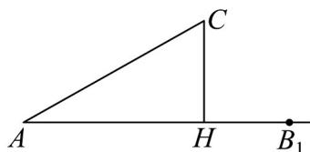

> [!faq]- 《专题07_正弦定理_余弦定理_高效培优期中专项训练_数学人教A版高一必》官方解析
>
> > [!success]- **【答案】** AD
>
> > [!note]- **【解析】**
> > 对于选项 $^{A}$ ，由正弦定理 $\frac{a}{\sin A}=\frac{b}{\sin B}=\frac{c}{\sin C}=2R$ （其中 $_{R}$ 是 $\bigvee ABC$ 外接圆的半径），得到 $\frac{2\sqrt{3}}{\sin\frac{\pi}{3}}=4=2R$ ，所以 $R=2$ ，则 $\bigtriangleup ABC$ 的外接圆的面积为 $\pi R^{2}=4\pi$ ，所以 $^{A}$ 正确，对于选项 $^{B}$ ，如图， $\angle CAB_{1}=\frac{\pi}{6}$ ，AC=b=5，过C作 $CH\perp AB_{1}$ 于H，则 $CH=AC\sin\angle CAB_{1}=5\sin\frac{\pi}{6}=\frac{5}{2}>2=a$ ，所以在射线 $AB_{1}$ 上不存在 $_{B}$ ，使 $A=30^{\circ}$ ，b=5，a=2，即无解，所以 $^{B}$ 错误，
> >
> > 
> >
> > 对于选项 $^{C}$ ，因为 $a^{2}+b^{2}<c^{2}$ ，由余弦定理得 $\cos C=\frac{a^{2}+b^{2}-c^{2}}{2ab}<0$ ，
> > 又 $C \in (0, \pi)$ ，所以 $\frac{\pi}{2} < C < \pi$ ，故 $\forall ABC$ 是钝角三角形，所以 $^{C}$ 错误，
> > 对于选项 $^{D}$ ，因为 $a^{3}+b^{3}=c^{3}$ ，则 a<c,b<c，且 $\left(\frac{a}{c}\right)^{3}+\left(\frac{b}{c}\right)^{3}=1$ ，
> > 所以 $0 < \frac{a}{c} < 1, 0 < \frac{b}{c} < 1$ ，则 $\left(\frac{a}{c}\right)^{3} < \left(\frac{a}{c}\right)^{2}, \left(\frac{b}{c}\right)^{3} < \left(\frac{b}{c}\right)^{2}$ 所以 $\left(\frac{a}{c}\right)^{3}+\left(\frac{b}{c}\right)^{3}<\left(\frac{a}{c}\right)^{2}+\left(\frac{b}{c}\right)^{2}$ ，得到 $1<\left(\frac{a}{c}\right)^{2}+\left(\frac{b}{c}\right)^{2}$ ，即 $a^{2}+b^{2}>c^{2}$ 由余弦定理得 $\cos C = \frac{a^{2} + b^{2} - c^{2}}{2ab} > 0$ ，又 $C \in (0, \pi)$ ，所以 $0 < C < \frac{\pi}{2}$ ，故 $\bigvee ABC$ 是锐角三角形，所以 $^{D}$ 正确，
> >
> > 故选 **AD**.
