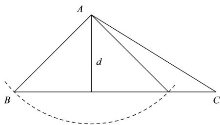

> [!faq]- 《专题07_正弦定理_余弦定理_高效培优期中专项训练_数学人教A版高一必》官方解析
>
> > [!success]- **【答案】** AD
>
> > [!note]- **【解析】**
> > A中， $\sin^{2}A+\sin^{2}B+\cos^{2}C<1$ ，即 $\sin^{2}A+\sin^{2}B<\sin^{2}C$ 由正弦定理可得 $a^{2}+b^{2}<c^{2}$ ，由余弦定理可得 $\cos C=\frac{a^{2}+b^{2}-c^{2}}{2ab}<0$ 因为 $C \in (0, \pi)$ ，所以 $C \in \left(\frac{\pi}{2}, \pi\right)$ ，即 C 为钝角，所以该三角形为钝角三角形，故 A 正确；
> > B 中，若 $B = \frac{\pi}{3}, a = 2\sqrt{3}$ ，且 ABC 有两解，则 $a \sin B < b < a$ ，即 $2\sqrt{3} \times \frac{\sqrt{3}}{2} < b < a$ ，
> > 即 b 的范围为 $(3, 2\sqrt{3})$ ，所以 B 错误；
> > C 中，在锐角 ABC 中，只有 A > B 时，不等式 $\sin A > \sin B$ 才恒成立，所以 C 不正确；
> > D 中，若 $B = 60^{\circ}, b^{2} = ac$ ，由余弦定理可得 $b^{2} = a^{2} + c^{2} - 2ac \cos B = a^{2} + c^{2} - ac$ 即 $ac = a^{2} + c^{2} - ac$ ，即 $(a - c)^{2} = 0$ ，所以 a = c，所以 VABC 必是等边三角形，故 D 正确。
> > 故选：AD.
> >
> > 24．如果满足 $\angle ABC=45^{\circ},AB=6,AC=b$ 的VABC有且只有一个，那么实数 $b$ 的取值范围是\_\_\_\_.
> >
> > 【答案】 $\left[6,+\infty\right)\cup\left\{3\sqrt{2}\right\}$
> >
> > 【详解】因为在VABC中， $\angle ABC=45^{\circ}$ ，AB=6，
> >
> > 所以 $A$ 到 $BC$ 距离 $d = AB\sin \angle ABC = 6\times \frac{\sqrt{2}}{2} = 3\sqrt{2}$
> >
> > 因为 $\vee ABC$ 有且只有一个，
> >
> > 所以由图可知 $b = 3\sqrt{2}$ 或 $b = 6$
> >
> > 即实数 b 的取值范围是 $\left[6,+\infty\right)\cup\left\{3\sqrt{2}\right\}$
> >
> > 故答案为： $[6, + \infty)\cup \{3\sqrt{2}\}$
> >
> > 
