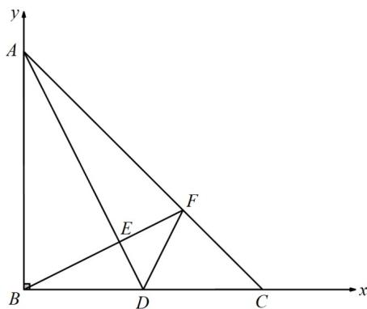

> [!faq]- 《专题07_正弦定理_余弦定理_高效培优期中专项训练_数学人教A版高一必》官方解析
>
> > [!success]- **【答案】** （1）等腰直角三角形；（2）证明见解析
>
> > [!note]- **【解析】**
> > 解：（1）由正弦定理得： $\sin A=\frac{a}{2R},\sin B=\frac{b}{2R},\sin C=\frac{c}{2R}$ ，其中 $^{R}$ 为 $\vee ABC$ 外接圆的半径·
> >
> > $\because a \sin A = c \sin C$ ，且 $\sin^2 B = \sin^2 A + \sin^2 C$ ， $\therefore a \cdot \frac{a}{2R} = c \cdot \frac{c}{2R}$ ， $(\frac{b}{2R})^2 = (\frac{a}{2R})^2 + (\frac{c}{2R})^2$ ， $\therefore a^2 = c^2, b^2 = a^2 + c^2$ ， $\therefore a = c, B = 90^0$ ，
> >
> > ∴VABC为等腰直角三角形；
> >
> > (2)以 B 为坐标原点，BC、BA 所在直线分别为 x 轴、y 轴建立平面直角坐标系.
> >
> > 设 $A(0,2)$ ， $C(2,0)$ ，则 $D(1,0)$ ， $AC = (2, - 2)$
> >
> > 设 $\overline{AF}=\lambda\overline{AC}$ ，则 $\overline{BF}=\overline{BA}+\overline{AF}=(0,2)+(2\lambda,-2\lambda)=(2\lambda,2-2\lambda)$
> >
> > 又因为 $\stackrel{\square\square\square}{DA} = (-1,2)$ ， $BF \perp DA$ ，
> >
> > 所以 $BF\cdot DA = 0$
> >
> > 所以 $-2\lambda + 2(2 - 2\lambda) = 0$
> >
> > 解得 $\lambda=\frac{2}{3}$
> >
> > 所以 $BF = \left( \frac{4}{3}, \frac{2}{3} \right)$ ，
> >
> > 所以 $\overline{DF} = \overline{BF} - \overline{BD} = (\frac{1}{3}, \frac{2}{3})$ ，又因为 $\overline{DC} = (10)$ ，
> >
> > 所以 $\cos\angle FDC=\frac{\overline{D}F\cdot\overline{D}G}{\left|\overline{DF}\right|\cdot\left|DC\right|}=\frac{\sqrt{5}}{5}$
> >
> > 又因为 $\cos\angle ADB=\frac{|BD|}{|AD|}=\frac{\sqrt{5}}{5}$ ，且 $\angle ADB, \angle FDC\in(0,\pi)$
> >
> > 所以 $\angle ADB = \angle FDC$
> >
> > 
> >
> > 考点09求三角形中边长、周长、面积的最值或范围
> >
> > 41. 锐角三角形 $\forall ABC$ 的内角 $A, B, C$ 的对边分别为 $a, b, c$ ，已知 $2\cos A (c\cos B + b\cos C) = a$
> >
> > (1)求 $A$
> >
> > (2)若 $a = 3$ ，求 $\mathsf{V}ABC$ 的周长的取值范围·
> >
> > 【答案】(1) $\frac{\pi}{3}$
> >
> > (2) $(3\sqrt{3}+3,9]$
> >
> > 【详解】（1）因为 $2\cos A(c\cos B + b\cos C) = a$
> >
> > 由正弦定理得 $2\cos A(\sin C\cos B + \sin B\cos C) = \sin A$
> >
> > 又因为 $B + C = \pi - A$ ，所以 $\sin C \cos B + \sin B \cos C = \sin (B + C) = \sin A$
> >
> > 所以 $2\cos A\sin A = \sin A$
> >
> > 因为 $\vee ABC$ 为锐角三角形，可得 $A \in (0, \frac{\pi}{2})$ ，所以 $\sin A > 0$ ，
> >
> > 所以 $\cos A = \frac{1}{2}$ ，可得 $A = \frac{\pi}{3}$ .
> >
> > (2) 由正弦定理可得 $\frac{a}{\sin A} = \frac{b}{\sin B} = \frac{c}{\sin C} = \frac{3}{\frac{\sqrt{3}}{2}} = 2\sqrt{3}$
> >
> > 所以 $b = 2\sqrt{3} \sin B, c = 2\sqrt{3} \sin C$
> >
> > $$
> > b + c = 2 \sqrt {3} (\sin B + \sin C) = 2 \sqrt {3} [ \sin B + \sin (\frac {2 \pi}{3} - B) ] = 2 \sqrt {3} [ \sin B + (\frac {\sqrt {3}}{2} \cos B + \frac {1}{2} \sin B) ]
> > $$
> >
> > $$
> > = 2 \sqrt {3} \cdot \left(\frac {3}{2} \sin B + \frac {\sqrt {3}}{2} \cos B\right) = 6 \sin \left(B + \frac {\pi}{6}\right)
> > $$
> >
> > 因为 为锐角三角形，可得 $\left\{ \begin{array}{l}0 < B < \frac{\pi}{2}\\ 0 < \frac{2\pi}{3} -B < \frac{\pi}{2} \end{array} \right.$ ，解得 $\frac{\pi}{6} <  B <   \frac{\pi}{2}$
> >
> > 可得 $B + \frac{\pi}{6} \in (\frac{\pi}{3}, \frac{2\pi}{3})$ ，所以 $\sin(B + \frac{\pi}{6}) \in (\frac{\sqrt{3}}{2}, 1]$ ，则 $6\sin(B + \frac{\pi}{6}) \in (3\sqrt{3}, 6]$
> >
> > 即 $b+c\in(3\sqrt{3},6]$ ，所以 $\forall ABC$ 的周长 $a+b+c\in(3\sqrt{3}+3,9]$
> >
> > 所以 $\forall ABC$ 的周长的取值范围为 $(3\sqrt{3} + 3, 9]$ .
